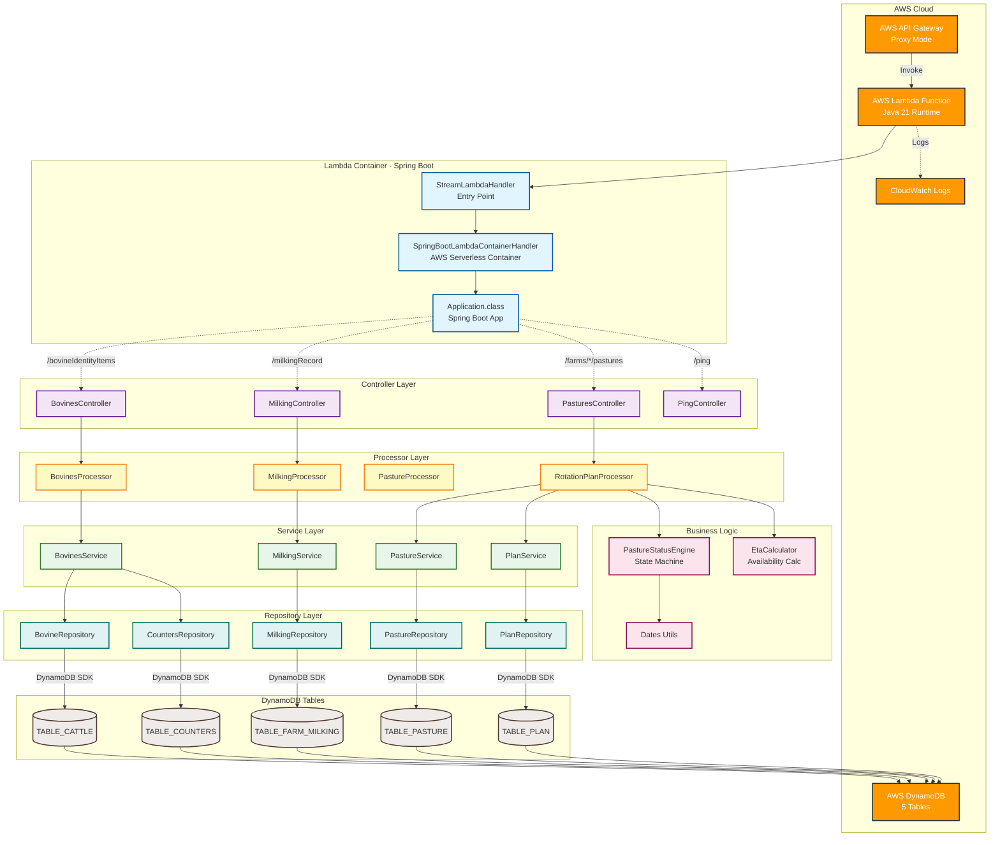

# Componente: cattle-lambda-function

## 📋 **Overview**

### Propósito

**cattle-lambda-function** es el backend serverless del sistema de gestión ganadera, implementado como una función AWS Lambda con Spring Boot 3. Proporciona una API REST completa para la gestión de bovinos, registro de lactancia, control de rotación de potreros y toda la lógica de negocio del sistema. Utiliza DynamoDB como base de datos NoSQL y se expone a través de AWS API Gateway en modo proxy.

### Contexto de Negocio

Este componente es el **cerebro del sistema** y maneja toda la lógica de negocio crítica:

- **Persistencia de datos** en DynamoDB con diseño de single-table optimizado
- **Reglas de negocio** como cálculo de ETA de potreros y estados automáticos
- **Motor de rotación** inteligente para gestión de pastoreo
- **Generación de IDs** auto-incrementales en DynamoDB
- **Validación de datos** y reglas de integridad
- **Exposición de APIs REST** para consumo del frontend

El componente opera en un modelo **serverless** sin servidores que gestionar, escalando automáticamente según demanda y optimizando costos al cobrar solo por ejecución real.

### Responsabilidades Principales

- **API REST completa** para bovinos, lactancia y potreros
- **Lógica de negocio compleja** como motor de rotación de potreros
- **Persistencia en DynamoDB** con manejo de claves compuestas y GSIs
- **Generación automática de IDs** mediante tabla de contadores
- **Cálculo de estados** y ETA (Estimated Time Available) para potreros
- **Procesamiento de eventos** para cambios de estado de potreros
- **Integración con AWS** (DynamoDB, CloudWatch, IAM)

### Ubicación

- **Repositorio**: cattle-lambda-function
- **Ruta**: `/cattle-lambda-function`
- **Tipo**: AWS Lambda Function (Serverless API)
- **Runtime**: Java 21
- **Framework**: Spring Boot 3.4.5

## 🏗️ **Architecture**

### Stack Tecnológico

- **Lenguaje**: Java 21 (LTS)
- **Framework**: Spring Boot 3.4.5
- **Container**: AWS Serverless Java Container 2.1.4 (SpringBoot3)
- **Base de datos**: AWS DynamoDB (Enhanced Client 2.32.16)
- **Build Tools**: Gradle + Maven (dual support)
- **Testing**: JUnit 5.13.1, Mockito 5.2.0
- **Logging**: Log4j 2.20.0 + SLF4J
- **Mappers**: MapStruct 1.5.2 (compile-time mapping)
- **Code Generation**: Lombok 1.18.34 (reduce boilerplate)
- **Deployment**: AWS SAM (Serverless Application Model)
- **HTTP Client**: AWS SDK 2.32.16
- **JSON**: Gson 2.11.0

### Patrones de Diseño

#### **Patrón Principal: Layered Architecture**

Arquitectura de capas claramente separadas:

- **Controller Layer**: Manejo de HTTP requests/responses, validación básica
- **Processor Layer**: Orquestación de lógica de negocio compleja
- **Service Layer**: Lógica de negocio específica por dominio
- **Repository Layer**: Acceso a datos DynamoDB
- **Entity Layer**: Modelos de datos mapeados a DynamoDB

#### **Patrones Adicionales**

- **Repository Pattern**: Abstracción del acceso a DynamoDB
- **DTO Pattern**: Data Transfer Objects para comunicación entre capas
- **Processor Pattern**: Coordinación de operaciones complejas multi-servicio
- **Event-Driven State Machine**: Motor de estados para potreros
- **Builder Pattern**: Construcción de entidades complejas (via Lombok)
- **Strategy Pattern**: Diferentes estrategias de cálculo (ETA, growth rate)

#### **Justificación**

- **Layered Architecture**: Separación de concerns, testabilidad, mantenibilidad
- **Repository Pattern**: Abstrae DynamoDB, facilita testing con mocks
- **DTO Pattern**: Desacopla API contracts de modelo de datos interno
- **Processor Layer**: Maneja complejidad de operaciones que involucran múltiples servicios
- **Serverless Container**: Permite usar Spring Boot completo en Lambda

### Estructura del Código

```
cattle-lambda-function/
├── src/
│   ├── main/
│   │   ├── java/com/cattle/
│   │   │   │
│   │   │   ├── Application.java                    # Spring Boot Application
│   │   │   ├── StreamLambdaHandler.java            # Lambda Entry Point
│   │   │   │
│   │   │   ├── controller/                         # REST Controllers (Layer 1)
│   │   │   │   ├── BovinesController.java          # CRUD Bovinos
│   │   │   │   ├── MilkingController.java          # Registro lactancia
│   │   │   │   ├── PasturesController.java         # Estado potreros
│   │   │   │   └── PingController.java             # Health check
│   │   │   │
│   │   │   ├── processor/                          # Processors (Layer 2)
│   │   │   │   ├── BovinesProcessor.java           # Orquesta ops bovinos
│   │   │   │   ├── MilkingProcessor.java           # Orquesta lactancia
│   │   │   │   ├── PastureProcessor.java           # Orquesta potreros
│   │   │   │   └── RotationPlanProcessor.java      # Motor rotación completo
│   │   │   │
│   │   │   ├── services/                           # Services (Layer 3)
│   │   │   │   ├── BovinesService.java             # Lógica negocio bovinos
│   │   │   │   ├── MilkingService.java             # Lógica negocio lactancia
│   │   │   │   ├── PastureService.java             # Lógica negocio potreros
│   │   │   │   └── PlanService.java                # Gestión planes rotación
│   │   │   │
│   │   │   ├── repository/                         # Repositories (Layer 4)
│   │   │   │   ├── BovineRepository.java           # DAO bovinos
│   │   │   │   ├── MilkingRepository.java          # DAO lactancia
│   │   │   │   ├── PastureRepository.java          # DAO potreros
│   │   │   │   ├── PlanRepository.java             # DAO planes
│   │   │   │   └── CountersRepository.java         # Auto-increment IDs
│   │   │   │
│   │   │   ├── entities/                           # Entity Models (DynamoDB)
│   │   │   │   ├── Bovine.java                     # Bovino entity
│   │   │   │   ├── FarmMilking.java                # Lactancia entity
│   │   │   │   ├── Pasture.java                    # Potrero entity
│   │   │   │   ├── Plan.java                       # Plan rotación entity
│   │   │   │   ├── Pregnancy.java                  # Preñez entity (no usado)
│   │   │   │   ├── Milking.java                    # Milking entity
│   │   │   │   ├── Lactation.java                  # Lactation entity
│   │   │   │   ├── Event.java                      # Event entity
│   │   │   │   ├── HealthEvent.java                # Health event
│   │   │   │   ├── Task.java                       # Task entity
│   │   │   │   ├── Counter.java                    # Counter entity
│   │   │   │   └── FarmBovine.java                 # Farm bovineIdentityItem
│   │   │   │
│   │   │   ├── dtos/                               # Data Transfer Objects
│   │   │   │   ├── BovineDTO.java                  # Bovino DTO
│   │   │   │   ├── MilkingDTO.java                 # Lactancia DTO
│   │   │   │   ├── PastureDTO.java                 # Potrero DTO
│   │   │   │   └── RotationSemaphoreItemDTO.java   # DTO semáforo rotación
│   │   │   │
│   │   │   ├── events/                             # Event System
│   │   │   │   ├── PastureEvent.java               # Base event pasture
│   │   │   │   ├── OpenEvent.java                  # Abrir potrero
│   │   │   │   ├── CloseEvent.java                 # Cerrar potrero
│   │   │   │   ├── MaintenanceSetEvent.java        # Poner en mantenimiento
│   │   │   │   ├── MaintenanceClearEvent.java      # Quitar mantenimiento
│   │   │   │   ├── EntityPatch.java                # Patch de entidad
│   │   │   │   └── PatchApplier.java               # Aplicador de patches
│   │   │   │
│   │   │   ├── enums/                              # Enumeraciones
│   │   │   │   ├── PastureStatus.java              # Estados potrero
│   │   │   │   ├── PastureSubstatus.java           # Subestados
│   │   │   │   ├── EventType.java                  # Tipos de evento
│   │   │   │   ├── PlanType.java                   # Tipos de plan
│   │   │   │   └── LogType.java                    # Tipos de log
│   │   │   │
│   │   │   ├── utils/                              # Utilities
│   │   │   │   ├── PastureStatusEngine.java        # Motor estados potreros
│   │   │   │   ├── EtaCalculator.java              # Cálculo ETA disponibilidad
│   │   │   │   └── Dates.java                      # Utilidades fechas
│   │   │   │
│   │   │   ├── mapper/                             # MapStruct Mappers
│   │   │   │   └── PasturesMapper.java             # Entity ↔ DTO
│   │   │   │
│   │   │   ├── builders/                           # Builders
│   │   │   │   └── (builders custom)
│   │   │   │
│   │   │   ├── exceptions/                         # Custom Exceptions
│   │   │   │   ├── NotFoundException.java
│   │   │   │   ├── ServiceException.java
│   │   │   │   ├── RepositoryException.java
│   │   │   │   └── ProcessingException.java
│   │   │   │
│   │   │   └── config/                             # Configuration
│   │   │       └── LambdaContext.java              # Context logging
│   │   │
│   │   └── resources/
│   │       ├── application.properties              # Spring Boot config
│   │       └── key-aws/                            # AWS keys (local dev)
│   │
│   └── test/                                       # Tests
│       └── java/com/cattle/
│           ├── StreamLambdaHandlerTest.java        # Lambda handler test
│           ├── controller/
│           │   └── BovinesControllerTest.java      # Controller test
│           ├── repository/
│           │   └── PastureRepositoryTest.java      # Repository test
│           └── utils/
│               ├── PastureStatusEngineTest.java    # Engine test
│               └── EtaCalculatorTest.java          # Calculator test
│
├── template.yml                                    # AWS SAM Template
├── build.gradle                                    # Gradle build config
├── pom.xml                                         # Maven build config
├── gradlew                                         # Gradle wrapper
├── gradlew.bat                                     # Gradle wrapper Windows
├── README.md                                       # Documentación
│
├── build/                                          # Gradle build output
├── target/                                         # Maven build output
├── .gradle/                                        # Gradle cache
└── gradle/                                         # Gradle wrapper files
    └── wrapper/
        └── gradle-wrapper.properties
```

### Diagrama Conceptual



## 🔌 **APIs**

### Endpoints Expuestos

#### REST Endpoints

| Método | Ruta | Controller | Descripción | Parámetros | Respuesta |
|--------|------|------------|-------------|------------|-----------|
| GET | `/bovineIdentityItems` | BovinesController | Listar todos los bovinos | - | `List<BovineDTO>` |
| GET | `/bovineIdentityItems/{id}` | BovinesController | Obtener bovino por ID | `id: Integer` | `BovineDTO` |
| POST | `/bovineIdentityItems` | BovinesController | Crear nuevo bovino | Body: `BovineDTO` | `BovineDTO` |
| PUT | `/bovineIdentityItems/{id}` | BovinesController | Actualizar bovino | `id: Long`, Body: `BovineDTO` | `BovineDTO` |
| GET | `/milkingRecord/{bovineId}?shift=AM\|PM` | MilkingController | Consultar lactancia por bovino | `bovineId: Integer`, `shift?: String` | `List<MilkingDTO>` |
| POST | `/milkingRecord` | MilkingController | Registrar nuevo ordeño | Body: `MilkingDTO` | `MilkingDTO` |
| GET | `/farms/{farmId}/pastures` | PasturesController | Estado de potreros con rotación | `farmId: String` | `List<RotationSemaphoreItemDTO>` |
| GET | `/ping` | PingController | Health check | - | `String: "pong"` |

#### Códigos de Error

| Código | Descripción | Casos |
|--------|-------------|-------|
| 200 | OK | Operación exitosa |
| 204 | No Content | GET bovineIdentityItems sin resultados |
| 400 | Bad Request | Validación fallida, parámetros inválidos |
| 404 | Not Found | Bovino no encontrado, recurso inexistente |
| 500 | Internal Server Error | Error de lógica de negocio, fallo DynamoDB |

#### Contratos y Versionamiento

- **Estrategia de versionado**: Sin versionado explícito actualmente (v1 implícito)
- **Versión actual**: 1.0-SNAPSHOT
- **Breaking changes**: No hay política formal definida
- **Content-Type**: `application/json` (request y response)

**⚠️ Mejora recomendada**: Implementar versionado en URLs (`/v1/bovineIdentityItems`) o headers.

### Eventos y Mensajería

#### Sistema de Eventos Interno (Potreros)

El sistema implementa un **motor de eventos** para gestión de estados de potreros:

| Evento | Clase | Descripción | Acción |
|--------|-------|-------------|--------|
| `OPEN` | OpenEvent | Abrir potrero para pastoreo | Cambia estado a EN_USO |
| `CLOSE` | CloseEvent | Cerrar potrero (fin pastoreo) | Cambia estado a EN_DESCANSO, registra lastUseAt |
| `MAINTENANCE_SET` | MaintenanceSetEvent | Poner en mantenimiento | Cambia estado a MANTENIMIENTO, establece holdUntil |
| `MAINTENANCE_CLEAR` | MaintenanceClearEvent | Quitar mantenimiento | Cambia estado según ETA (DISPONIBLE o EN_DESCANSO) |

**⚠️ Estado actual**: Eventos definidos pero **sin endpoints REST** para ejecutarlos desde frontend.

#### Mensajería Externa

**N/A** - No hay integración con sistemas de mensajería externos (SQS, SNS, EventBridge) actualmente.

## 📦 **Dependencies**

### Dependencias Externas

#### Librerías Críticas

| Librería | Versión | Propósito | Criticidad |
|----------|---------|-----------|------------|
| spring-boot-starter-web | 3.4.5 | Framework web REST | 🔴 Crítica |
| aws-serverless-java-container-springboot3 | 2.1.4 | Adaptador Spring Boot a Lambda | 🔴 Crítica |
| dynamodb-enhanced | 2.32.16 | Cliente mejorado DynamoDB | 🔴 Crítica |
| dynamodb | 2.32.16 | SDK base DynamoDB | 🔴 Crítica |
| lombok | 1.18.34 | Reducción de boilerplate | 🟡 Importante |
| mapstruct | 1.5.2 | Mapeo Entity ↔ DTO | 🟡 Importante |
| log4j | 2.20.0 | Logging framework | 🟡 Importante |
| gson | 2.11.0 | Serialización JSON | 🟢 Opcional |
| junit-jupiter | 5.13.1 | Testing framework | 🟢 Opcional (dev) |
| mockito | 5.2.0 | Mocking para tests | 🟢 Opcional (dev) |

#### Servicios Externos

- **AWS DynamoDB**: Base de datos NoSQL principal
  - Región: us-east-1
  - 5 tablas: TABLE_CATTLE, TABLE_FARM_MILKING, TABLE_PASTURE, TABLE_PLAN, TABLE_COUNTERS
  - Criticidad: 🔴 Crítica (sin DynamoDB, no hay persistencia)

- **AWS Lambda Runtime**: Entorno de ejecución
  - Runtime: Java 21 (managed runtime)
  - Criticidad: 🔴 Crítica

- **AWS IAM**: Autenticación y autorización
  - Execution Role con permisos DynamoDB
  - Criticidad: 🔴 Crítica

- **AWS CloudWatch**: Logs y monitoring
  - Criticidad: 🟡 Importante (para debugging)

### Dependencias Internas

#### Componentes del Sistema

- **cattle-front (Frontend)**: Consumidor principal de la API
  - Todas las operaciones de UI dependen de este backend
  - Comunicación: HTTP REST sobre API Gateway

#### Bases de Datos

**DynamoDB Tables:**

- **TABLE_CATTLE**: Bovinos (PK: BOVINE#id, SK: PROFILE)
  - GSI1: Por farmId
  - GSI2: Por status
  
- **TABLE_FARM_MILKING**: Registros de lactancia (PK: BOVINE#id, SK: LACTANCIA#date#shift)
  
- **TABLE_PASTURE**: Potreros (PK: PASTURE#id)
  - GSI1: Por farmId + species + eta
  - GSI2: Por farmId + eta
  
- **TABLE_PLAN**: Planes de rotación (PK: PLAN#FARM#farmId#SPECIES#species)
  
- **TABLE_COUNTERS**: Auto-increment IDs (PK: COUNTER#tableName, SK: CURRENT)

### Quién Usa Este Componente

#### Consumidores Directos

- **cattle-front (Frontend React)**: Consumidor principal
  - Todos los módulos (Bovinos, Lactancia, Potreros)
  - Comunicación vía axios/fetch a través de API Gateway

#### Consumidores Indirectos

**N/A** - No hay otros sistemas que consuman este backend actualmente.

### Gestión de Dependencias

```bash
# === GRADLE ===

# Instalar dependencias y build
./gradlew build

# Ejecutar tests
./gradlew test

# Generar reportes de dependencias
./gradlew dependencies

# Verificar dependencias desactualizadas
./gradlew dependencyUpdates

# Limpiar build
./gradlew clean

# === MAVEN ===

# Instalar dependencias y build
mvn clean install

# Ejecutar tests
mvn test

# Ver árbol de dependencias
mvn dependency:tree

# Verificar vulnerabilidades
mvn dependency-check:check

# Actualizar dependencias (interactive)
mvn versions:display-dependency-updates
```

## 🚀 **Deployment**

### Configuración de Entorno

#### Variables de Entorno Requeridas

| Variable | Descripción | Ejemplo | Requerida |
|----------|-------------|---------|-----------|
| `TABLE_CATTLE` | Nombre tabla DynamoDB bovinos | `cattle-bovineIdentityItems-prod` | ✅ Sí |
| `TABLE_FARM_MILKING` | Nombre tabla DynamoDB lactancia | `cattle-milkingRecord-prod` | ✅ Sí |
| `TABLE_PASTURE` | Nombre tabla DynamoDB potreros | `cattle-pasture-prod` | ✅ Sí |
| `TABLE_PLAN` | Nombre tabla DynamoDB planes | `cattle-plan-prod` | ✅ Sí |
| `TABLE_COUNTERS` | Nombre tabla DynamoDB contadores | `cattle-counters-prod` | ✅ Sí |
| `AWS_REGION` | Región AWS | `us-east-1` | ✅ Sí (auto en Lambda) |

**Nota**: Variables configuradas en `template.yml` (AWS SAM) y asignadas automáticamente por Lambda.

#### Configuración en template.yml

```yaml
Environment:
  Variables:
    TABLE_CATTLE: cattle-bovineIdentityItems-dev
    TABLE_FARM_MILKING: cattle-milkingRecord-dev
    TABLE_PASTURE: cattle-pasture-dev
    TABLE_PLAN: cattle-plan-dev
    TABLE_COUNTERS: cattle-counters-dev
```

### Comandos de Desarrollo

#### Setup Inicial

```bash
# Clonar repositorio
git clone https://github.com/jhonroberth0303/cattle-lambda-function.git
cd cattle-lambda-function

# Instalar dependencias con Gradle
./gradlew build

# O con Maven
mvn clean install

# Instalar AWS SAM CLI (si no está instalado)
# Windows: choco install aws-sam-cli
# Mac: brew install aws-sam-cli
# Linux: pip install aws-sam-cli

# Configurar AWS CLI
aws configure
# Ingresar: Access Key, Secret Key, Region (us-east-1), Output (json)
```

#### Compilación

```bash
# Build con Gradle
./gradlew clean build

# Build con Maven
mvn clean package

# Build con SAM (incluye empaquetado Lambda)
sam build

# Verificar artifact
ls -la build/distributions/  # Gradle
ls -la target/              # Maven
```

**Output**: 
- Gradle: `build/distributions/cattle-bovineIdentityItems-functions-aws.zip`
- Maven: `target/cattle-bovineIdentityItems-functions-aws-1.0-SNAPSHOT.jar`

#### Testing

```bash
# Tests unitarios con Gradle
./gradlew test

# Tests con Maven
mvn test

# Tests con reporte de coverage (si configurado)
./gradlew test jacocoTestReport

# Ver reporte de tests
# Gradle: build/reports/tests/test/index.html
# Maven: target/surefire-reports/

# Ejecutar test específico
./gradlew test --tests BovinesControllerTest
mvn test -Dtest=BovinesControllerTest
```

#### Ejecución Local

```bash
# Iniciar API local con SAM
sam local start-api
# → Disponible en http://127.0.0.1:3000

# Invocar función Lambda directamente (con evento)
sam local invoke CattleBovinesFunctionsAwsFunction -e events/event.json

# Generar evento de prueba
sam local generate-event apigateway aws-proxy > events/test-event.json

# Debug mode (con debugger Java)
sam local start-api --debug-port 5858

# Health check local
curl http://127.0.0.1:3000/ping
```

### Pipeline de Despliegue

#### Prerequisitos de Infraestructura

- **AWS Account** con permisos de:
  - Lambda (crear/actualizar functions)
  - API Gateway (crear/actualizar APIs)
  - DynamoDB (crear/acceder tablas)
  - IAM (crear execution roles)
  - CloudFormation (deploy stacks)
  - S3 (bucket para artifacts)

- **DynamoDB Tables** creadas previamente o via SAM template

- **IAM Execution Role** con políticas:
  - `AWSLambdaBasicExecutionRole`
  - DynamoDB full access a tablas específicas

#### Etapas del Pipeline

1. **Build Stage**
   - Compilar código Java: `./gradlew build` o `mvn package`
   - Ejecutar tests: `./gradlew test`
   - Generar artifact (ZIP/JAR)
   - Validar SAM template: `sam validate`
   - Comandos:
     ```bash
     ./gradlew clean build
     sam validate --template template.yml
     sam build
     ```

2. **Test Stage**
   - Ejecutar tests unitarios: JUnit
   - Verificar coverage mínimo (si configurado)
   - Linting (si configurado)
   - Comandos:
     ```bash
     ./gradlew test
     # ./gradlew check (checkstyle si configurado)
     ```

3. **Package Stage**
   - Empaquetar Lambda con SAM
   - Subir artifact a S3
   - Comandos:
     ```bash
     sam package \
       --template-file template.yml \
       --output-template-file packaged.yml \
       --s3-bucket cattle-deployment-bucket
     ```

4. **Deploy Stage**
   - Deploy via CloudFormation
   - Actualizar Lambda function
   - Actualizar API Gateway
   - Comandos:
     ```bash
     sam deploy \
       --template-file packaged.yml \
       --stack-name cattle-backend-prod \
       --capabilities CAPABILITY_IAM \
       --region us-east-1
     ```

#### Variables de Entorno por Ambiente

**Desarrollo (Local):**
```yaml
TABLE_CATTLE: cattle-bovineIdentityItems-local
TABLE_FARM_MILKING: cattle-milkingRecord-local
TABLE_PASTURE: cattle-pasture-local
TABLE_PLAN: cattle-plan-local
TABLE_COUNTERS: cattle-counters-local
AWS_REGION: us-east-1
```

**Staging:**
```yaml
TABLE_CATTLE: cattle-bovineIdentityItems-staging
TABLE_FARM_MILKING: cattle-milkingRecord-staging
TABLE_PASTURE: cattle-pasture-staging
TABLE_PLAN: cattle-plan-staging
TABLE_COUNTERS: cattle-counters-staging
AWS_REGION: us-east-1
```

**Producción:**
```yaml
TABLE_CATTLE: cattle-bovineIdentityItems-prod
TABLE_FARM_MILKING: cattle-milkingRecord-prod
TABLE_PASTURE: cattle-pasture-prod
TABLE_PLAN: cattle-plan-prod
TABLE_COUNTERS: cattle-counters-prod
AWS_REGION: us-east-1
```

### Buenas Prácticas de Despliegue

- **Deployments inmutables**: Cada deploy es una nueva versión de Lambda
- **Versioning de Lambda**: Publicar versiones y usar aliases (prod, staging)
- **Blue-Green deployment**: Usar Lambda aliases con traffic shifting
- **Canary deployments**: Desplegar gradualmente con CodeDeploy
- **Automated rollback**: Configurar alarmas CloudWatch para rollback automático
- **Warm-up de Lambda**: Pre-warming para evitar cold starts en producción
- **Monitoring**: Configurar X-Ray para tracing distribuido
- **Logs estructurados**: Usar JSON logging para análisis en CloudWatch Insights

### Pasos Manuales

**Deployment Manual (primera vez):**

1. **Build del proyecto**:
   ```bash
   ./gradlew clean build
   sam build
   ```

2. **Deploy guiado (primera vez)**:
   ```bash
   sam deploy --guided
   ```
   
   Responder prompts:
   - Stack Name: `cattle-backend-dev`
   - AWS Region: `us-east-1`
   - Confirm changes: `Y`
   - Allow SAM CLI IAM role creation: `Y`
   - Authorize API Gateway: `Y`
   - Save arguments: `Y`

3. **Configurar variables de entorno** (si no están en template.yml):
   ```bash
   aws lambda update-function-configuration \
     --function-name CattleBovinesFunctionsAwsFunction \
     --environment Variables="{TABLE_CATTLE=cattle-bovineIdentityItems-dev,TABLE_FARM_MILKING=cattle-milkingRecord-dev,...}"
   ```

4. **Crear tablas DynamoDB** (si no existen):
   ```bash
   aws dynamodb create-table --cli-input-json file://dynamodb-tables.json
   ```

**Deployments subsecuentes:**

```bash
sam build
sam deploy  # Usa configuración guardada
```

### Rollback

```bash
# Ver versiones de Lambda
aws lambda list-versions-by-function \
  --function-name CattleBovinesFunctionsAwsFunction

# Rollback a versión anterior actualizando alias
aws lambda update-alias \
  --function-name CattleBovinesFunctionsAwsFunction \
  --name prod \
  --function-version $PREVIOUS_VERSION

# O rollback completo de CloudFormation stack
aws cloudformation update-stack \
  --stack-name cattle-backend-prod \
  --use-previous-template

# Rollback automático si hay alarmas configuradas
# (requiere CodeDeploy configurado)
```

### Monitoreo Post-Despliegue

```bash
# Health check
curl https://xi0ygax4hg.execute-api.us-east-1.amazonaws.com/dev/ping

# Ver logs en tiempo real
aws logs tail /aws/lambda/CattleBovinesFunctionsAwsFunction --follow

# Filtrar errores
aws logs filter-pattern /aws/lambda/CattleBovinesFunctionsAwsFunction \
  --filter-pattern "ERROR" \
  --start-time $(date -d '5 minutes ago' +%s)000

# Métricas de Lambda
aws cloudwatch get-metric-statistics \
  --namespace AWS/Lambda \
  --metric-name Invocations \
  --dimensions Name=FunctionName,Value=CattleBovinesFunctionsAwsFunction \
  --start-time $(date -u -d '1 hour ago' +%Y-%m-%dT%H:%M:%S) \
  --end-time $(date -u +%Y-%m-%dT%H:%M:%S) \
  --period 300 \
  --statistics Sum

# Verificar errores
aws cloudwatch get-metric-statistics \
  --namespace AWS/Lambda \
  --metric-name Errors \
  --dimensions Name=FunctionName,Value=CattleBovinesFunctionsAwsFunction \
  --start-time $(date -u -d '1 hour ago' +%Y-%m-%dT%H:%M:%S) \
  --end-time $(date -u +%Y-%m-%dT%H:%M:%S) \
  --period 300 \
  --statistics Sum

# Duration (performance)
aws cloudwatch get-metric-statistics \
  --namespace AWS/Lambda \
  --metric-name Duration \
  --dimensions Name=FunctionName,Value=CattleBovinesFunctionsAwsFunction \
  --start-time $(date -u -d '1 hour ago' +%Y-%m-%dT%H:%M:%S) \
  --end-time $(date -u +%Y-%m-%dT%H:%M:%S) \
  --period 300 \
  --statistics Average,Maximum
```

**Recomendaciones**:
- Configurar CloudWatch Alarms para errores, latencia, throttling
- Implementar AWS X-Ray para distributed tracing
- Usar CloudWatch Insights para análisis de logs
- Configurar SNS notifications para alertas críticas

---

## 🔧 **Lógica de Negocio Crítica**

### Motor de Rotación de Potreros

**Ubicación**: `PastureStatusEngine.java` + `RotationPlanProcessor.java`

**Funcionalidad**: Sistema automático que:
1. Calcula ETA (días hasta disponibilidad) de cada potrero
2. Actualiza estados automáticamente según reglas de negocio
3. Aplica "tick" en cada consulta GET para mantener estados sincronizados
4. Genera patches DynamoDB solo si hay cambios

**Algoritmo ETA**:
```
ETA = restDays - daysSinceLastUse + (minHeightCm - currentHeightCm) / growthRateCmPerDay
```

**Estados posibles**:
- `EN_DESCANSO`: Potrero descansando post-pastoreo
- `DISPONIBLE`: Listo para usar (ETA <= 0)
- `EN_USO`: Actualmente en pastoreo
- `MANTENIMIENTO`: Bloqueado por mantenimiento

### Generación de IDs Auto-incrementales

**Ubicación**: `CountersRepository.java`

**Funcionalidad**: Simula auto-increment en DynamoDB mediante:
1. Query atómica a TABLE_COUNTERS
2. Incremento con UpdateItem y condition expression
3. Retry automático si hay conflicto de concurrencia

**Código crítico**:
```java
UpdateItemRequest updateItemRequest = UpdateItemRequest.builder()
    .tableName(TABLE_COUNTERS)
    .key(key)
    .updateExpression("ADD currentId :inc")
    .expressionAttributeValues(Map.of(":inc", AttributeValue.builder().n("1").build()))
    .returnValues(ReturnValue.UPDATED_NEW)
    .build();
```

---

## 📝 **Notas de Mantenimiento**

| Fecha | Versión | Cambios | Autor |
|-------|---------|---------|-------|
| 2025-12-01 | 1.0 | Documentación inicial completa del componente cattle-lambda-function | Método Ceiba - Arquitecto |

---

## 🚨 **Deuda Técnica Identificada**

### Crítica

1. **Sin validación de tokens OAuth**: Backend no valida tokens de Google OAuth del frontend
2. **Sin autorización**: No hay roles, permisos o control de acceso
3. **Eventos sin endpoints**: Clases OpenEvent, CloseEvent existen pero sin APIs REST

### Importante

4. **Gestión de Preñez incompleta**: Entity Pregnancy existe pero sin controller/service
5. **Timeouts no optimizados**: Lambda con 30s timeout genérico
6. **Sin retry policies personalizados**: Usa defaults de AWS SDK
7. **Logging básico**: Falta structured logging con JSON

### Deseable

8. **Sin caché**: Todas las queries van a DynamoDB directamente
9. **Cold starts**: Java 21 Lambda puede tener cold starts de 3-5 segundos
10. **Sin versionado de API**: API sin versionado explícito en URLs

---

**📌 Esta documentación debe actualizarse con cada cambio significativo en el componente.**

_Documentación generada con Método Ceiba - Arquitecto_
_Última actualización: Diciembre 1, 2025_
