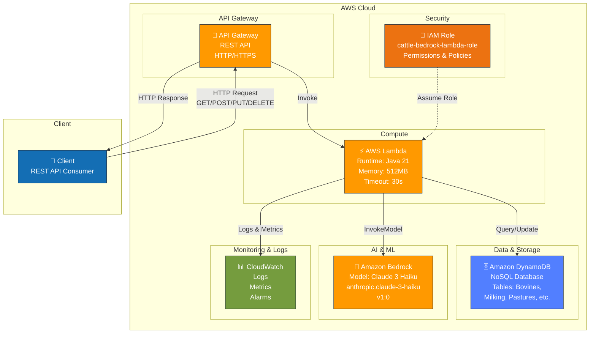
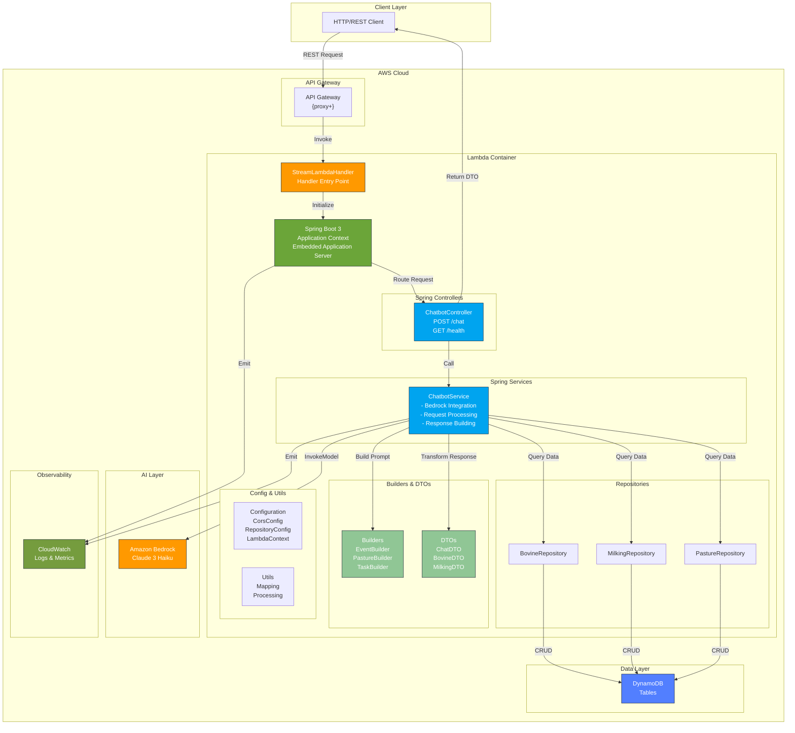
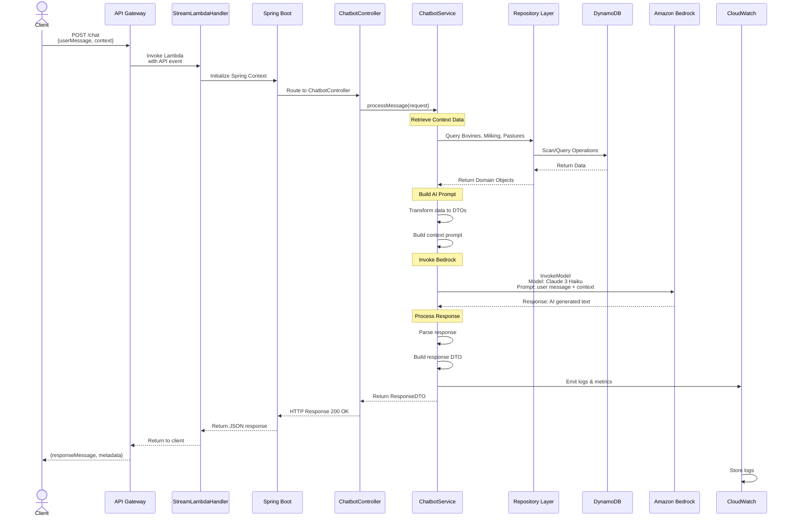
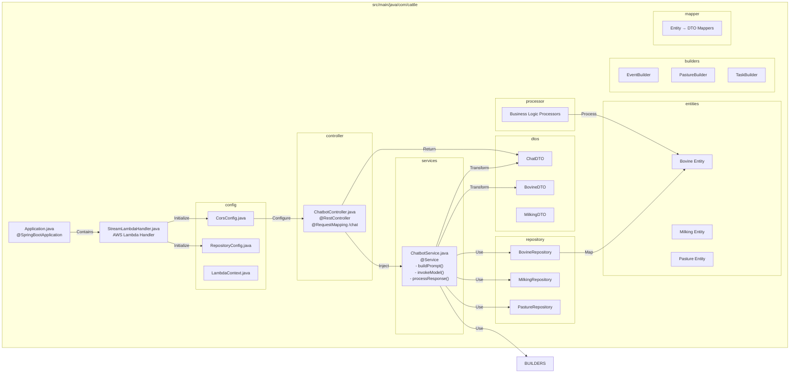

# Arquitectura de Cattle-Bedrock

## Diagrama C4 - Nivel 1 (Sistema Completo)



## Diagrama C4 - Nivel 2 (Contenedores)



## Diagrama C4 - Nivel 3 (Componentes - Flujo de Solicitud de Chat)



## Diagrama C4 - Nivel 4 (Código)



## Pilas Tecnológicas

### 🖥️ Lenguajes & Runtimes
- **Java 21**: Lenguaje de programación principal
- **YAML**: Configuración CloudFormation

### 🏗️ Frameworks & Bibliotecas
- **Spring Boot 3.4.5**: Framework principal
- **Spring Web**: Controladores REST
- **Spring Data**: Acceso a datos
- **Lombok**: Generación automática de código (Builders, Getters/Setters)

### ☁️ Servicios AWS
- **Lambda**: Computación sin servidor
- **API Gateway**: Enrutador HTTP
- **DynamoDB**: Base de datos NoSQL
- **Amazon Bedrock**: Servicio de modelos IA
- **CloudWatch**: Registro y monitoreo
- **IAM**: Gestión de identidad y acceso

### 🤖 Modelos IA
- **Claude 3 Haiku**: Modelo de lenguaje de Anthropic
  - Función: Procesamiento de prompts y generación de respuestas
  - Uso: Análisis de contexto ganadero, recomendaciones

### 📦 Build & Deploy
- **Maven**: Gestor de dependencias
- **Gradle**: Gestor de construcción
- **SAM CLI**: AWS Serverless Application Model
- **CloudFormation**: Infraestructura como código

## Flujo de Despliegue

```
┌─────────────────┐
│   Código Fuente │
│   (Java/Spring) │
└────────┬────────┘
         │
         ▼
┌─────────────────────┐
│   Build Process     │
│ Maven/Gradle Build  │
│ JAR Package         │
└────────┬────────────┘
         │
         ▼
┌──────────────────────┐
│  AWS SAM Package     │
│  template.yml        │
│  S3 Upload           │
└────────┬─────────────┘
         │
         ▼
┌──────────────────────┐
│ CloudFormation Stack │
│ Crea:                │
│ - Lambda Function    │
│ - API Gateway        │
│ - IAM Role           │
│ - DynamoDB Tables    │
└────────┬─────────────┘
         │
         ▼
┌──────────────────────┐
│   Lambda en Prod     │
│   Servicio Activo    │
└──────────────────────┘
```

## Permisos IAM - Matriz de Acceso

| Servicio | Acción | Recurso | Propósito |
|----------|--------|---------|-----------|
| **Bedrock** | `bedrock:InvokeModel` | `foundation-model/anthropic.claude-3-haiku-20240307-v1:0` | Invocar modelo Claude |
| **Bedrock** | `bedrock:ListFoundationModels` | `*` | Listar modelos disponibles |
| **DynamoDB** | `GetItem` | `arn:aws:dynamodb:*:*:table/*` | Lectura de registros |
| **DynamoDB** | `PutItem` | `arn:aws:dynamodb:*:*:table/*` | Insertar registros |
| **DynamoDB** | `UpdateItem` | `arn:aws:dynamodb:*:*:table/*` | Actualizar registros |
| **DynamoDB** | `Query` | `arn:aws:dynamodb:*:*:table/*` | Consultar datos |
| **DynamoDB** | `Scan` | `arn:aws:dynamodb:*:*:table/*` | Escanear tabla |
| **Logs** | `logs:*` | `*` | CloudWatch Logs |

## Endpoints Disponibles

```
POST /chat
  ├─ Body: {userMessage: string, context?: object}
  └─ Response: {responseMessage: string, metadata: object}

GET /health
  └─ Response: {status: UP, timestamp: datetime}

GET /models
  └─ Response: {availableModels: []}
```

## Configuración de Lambda

| Parámetro | Valor |
|-----------|-------|
| **Runtime** | Java 21 |
| **Memory** | 512 MB |
| **Timeout** | 30 segundos |
| **Handler** | `com.cattle.StreamLambdaHandler::handleRequest` |
| **Architecture** | x86_64 |
| **Layers** | - |

## Ambientes

- **Development**: Local (Maven + Spring Boot)
- **Production**: AWS Lambda + API Gateway

## Seguridad

- ✅ Encriptación en tránsito (HTTPS via API Gateway)
- ✅ Encriptación en reposo (DynamoDB)
- ✅ IAM Role con permisos específicos
- ✅ CORS configurado en Spring
- ✅ Lambda en VPC privada (opcional)

