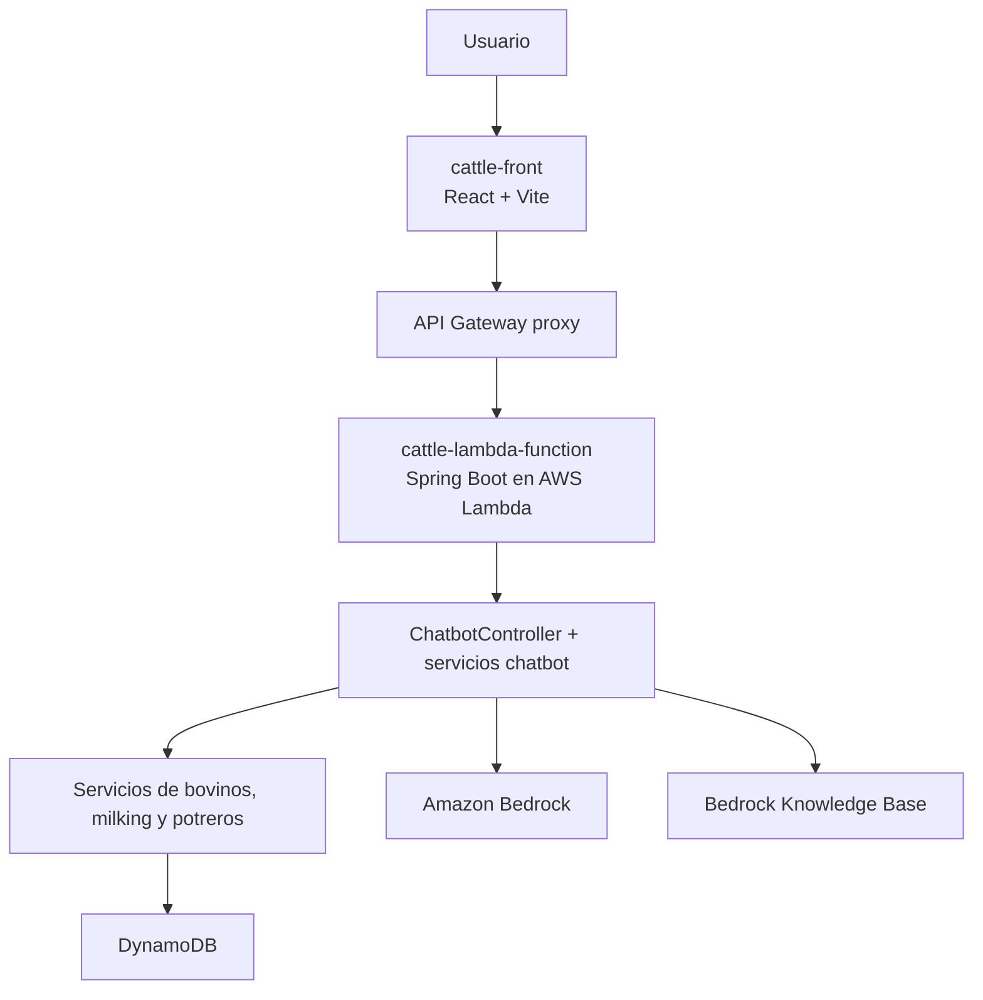

# Ecosistema Cattle para Chatbot y Datos

## Propósito

Este documento resume cómo encaja el módulo de chatbot dentro del ecosistema actual de Cattle sin reutilizar la topología antigua de un repositorio independiente.

## Repositorios activos observados

El workspace actual muestra dos repositorios activos para este ecosistema:

- `cattle-front`: SPA React con la experiencia conversacional y módulos operativos.
- `lambda-aws-cattle-java`: backend serverless con dominios de negocio, API REST, Bedrock y Knowledge Base.

No hay evidencia en el workspace de un repositorio activo separado llamado `cattle-bedrock`.

## Vista de alto nivel

## Flujo principal de consulta sobre datos de finca

1. El usuario interactúa desde `cattle-front`.
2. El frontend llama al backend por `POST /api/chat/message`.
3. `ChatbotController` valida contexto de seguridad, rate limiting y sanitización.
4. `ChatbotService` detecta intención y construye contexto mediante servicios de consulta.
5. `BedrockService` invoca el modelo configurado.
6. La respuesta vuelve al frontend como `ChatResponseDTO`.

## Flujo principal de consulta a Knowledge Base

1. El frontend llama a `POST /api/chat/knowledge`.
2. `ChatbotController` aplica los mismos controles transversales de contexto.
3. `KnowledgeBaseService` llama a `RetrieveAndGenerate` mediante `BedrockAgentRuntimeClient`.
4. El servicio retorna respuesta, citaciones y fuentes.

## Dependencias entre capas

### Frontend

- provee la interfaz de usuario y la sesión inicial
- depende del backend para respuesta conversacional

### Backend

- concentra la API, seguridad, lógica de negocio y capacidades Bedrock
- reutiliza datos de bovinos, milking y potreros para enriquecer prompts

### AWS

- API Gateway publica la API
- Lambda ejecuta Spring Boot
- DynamoDB almacena datos operativos
- Bedrock y Knowledge Base resuelven la parte generativa

## Restricciones y gaps vigentes

- La arquitectura vigente es integrada; cualquier documento que todavía dependa de `cattle-bedrock` debe leerse como legado.
- El backend necesita variables de entorno adicionales para todas sus dependencias de datos y Knowledge Base, pero no todas aparecen declaradas en SAM.
- La sesión del frontend y la seguridad backend todavía requieren alineación documental y técnica más fina.

## Uso recomendado

Este documento sirve como mapa del ecosistema para el dominio chatbot. Para decisiones técnicas específicas, usar como fuente principal:

- `ARCHITECTURE.md`
- `../architecture-cattle-lambda-function.md`
- `../../README.md`