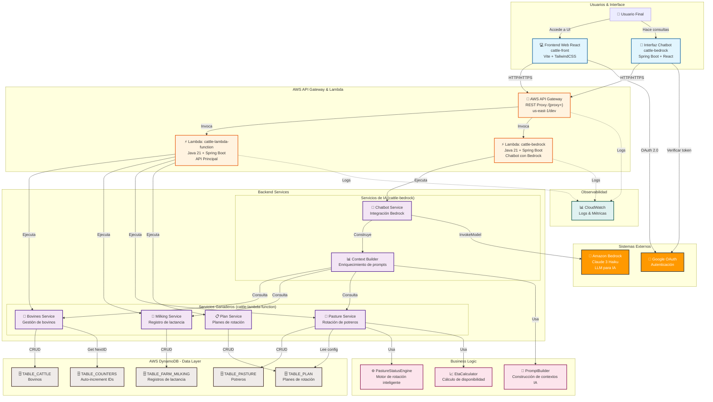
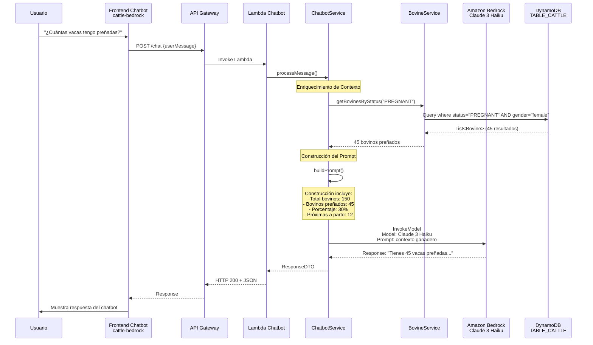

# 🐄 Arquitectura del Ecosistema Cattle - GPS Principal

**Documento de Navegación Arquitectónica para Estudios de IA con LLMs, Agentes y Chatbots Inteligentes**

Este documento sirve como **GPS arquitectónico** del ecosistema completo Cattle para guiar el desarrollo cuando llegan nuevas historias de usuario, especialmente enfocado en la integración entre **DynamoDB** y **Amazon Bedrock** para proporcionar un chatbot inteligente especializado en gestión ganadera.

---

## 🎯 **Visión General del Sistema**

### Propósito Principal

**Cattle** es una **plataforma de gestión ganadera integral** diseñada para administrar fincas ganaderas con una arquitectura moderna **serverless en AWS**. El objetivo principal es desarrollar un **chatbot inteligente impulsado por LLMs** (Amazon Bedrock - Claude 3 Haiku) que responda consultas sobre:

- 📊 **Edades de bovinos** y distribución demográfica
- 🐄 **Conteo de bovinos** por categoría (vacas, toros, terneros, novillas)
- 🤰 **Estado reproductivo**: cuántos están preñados, cuáles son crías para destete
- ♀️♂️ **Distribución por género**: conteo de hembras y machos
- 🌱 **Rotación de potreros** y disponibilidad de pastoreo
- 🥛 **Producción láctea** y registros de ordeño

El sistema integra:
- ✅ **Frontend React moderno** para UI intuitiva
- ✅ **Backend serverless** en AWS Lambda con Spring Boot
- ✅ **Base de datos NoSQL** en DynamoDB con datos ganaderos reales
- ✅ **Amazon Bedrock** para procesamiento de lenguaje natural
- ✅ **Google OAuth** para autenticación

### Distribución del Ecosistema

- **Total de repositorios identificados**: 3
- **Dominios/módulos principales**: Frontend Web, Backend Serverless, y Chatbot IA
- **Repositorios críticos**:
  1. **cattle-bedrock** - Chatbot IA con Claude 3 Haiku (en desarrollo - integración DynamoDB pendiente)
  2. **cattle-lambda-function** - API serverless con lógica de negocio y datos
  3. **cattle-front** - Frontend React para UI de gestión ganadera

### Caso de Uso Prioritario: Chatbot Inteligente para Consultas Ganaderas

**Estado actual**: 🟡 En desarrollo
- ✅ Chatbot básico conectado a Bedrock
- ✅ Endpoints de Lambda funcionales
- ❌ **PENDIENTE**: Conexión a DynamoDB para enriquecer prompts con datos reales

**Flujo objetivo**:
```
Usuario pregunta: "¿Cuántas vacas tengo preñadas?"
    ↓
Chatbot captura: "consulta sobre bovinos preñados"
    ↓
Backend consulta DynamoDB: TABLE_CATTLE
    ↓
Filtra: status="PREGNANT" AND gender="female" AND category="cow"
    ↓
Construye contexto: "De 150 bovinos, 45 son vacas preñadas"
    ↓
Bedrock genera respuesta inteligente con contexto ganadero
    ↓
Respuesta: "Tienes 45 vacas preñadas actualmente (30% del rebaño).
            Próximas a parto: 12 en las próximas 2 semanas."
```

---

## 🏗️ **Diagrama de Arquitectura de Alto Nivel**



---

## 🗂️ **Mapa de Repositorios por Dominio**

### 🐄 Dominio: Gestión Ganadera (Datos & API)

**Repositorio Principal**: `cattle-lambda-function`

- **Stack principal**: Java 21, Spring Boot 3.4.5, AWS Lambda, DynamoDB Enhanced Client
- **Función**: API REST serverless para gestión de bovinos, lactancia y potreros
- **Estado**: ✅ **Activo - Producción ready**
- **Ubicación**: `/cattle-lambda-function`
- **Responsabilidades**:
  - CRUD de bovinos (edades, géneros, categorías, estados reproductivos)
  - Registro de lactancia y ordeños
  - Motor inteligente de rotación de potreros
  - Generación de IDs auto-incrementales
  - Persistencia en DynamoDB

**Subcomponentes dentro de cattle-lambda-function**:

| Componente | Stack | Propósito |
|-----------|-------|----------|
| BovinesController/Service | Java + Spring | CRUD bovinos: crear, listar, actualizar, consultar |
| MilkingController/Service | Java + Spring | Registro de producción láctea |
| PasturesController/Service | Java + Spring | Gestión de potreros y rotación |
| PastureStatusEngine | Java | Motor de estados automático para potreros |
| EtaCalculator | Java | Cálculo de disponibilidad de potreros |
| CountersRepository | Java + DynamoDB | Generación de IDs auto-incrementales |

---

### 🤖 Dominio: Chatbot IA (Bedrock)

**Repositorio**: `cattle-bedrock`

- **Stack principal**: Java 21, Spring Boot 3.4.5, AWS Lambda, Amazon Bedrock
- **Función**: Chatbot inteligente impulsado por Claude 3 Haiku
- **Estado**: 🟡 **En desarrollo - Integración DynamoDB pendiente**
- **Ubicación**: `/cattle-bedrock`
- **Responsabilidades**:
  - Procesamiento de consultas en lenguaje natural
  - Construcción de prompts contextualizados
  - Invocación del modelo Claude 3 Haiku en Bedrock
  - **PRÓXIMO**: Integración con DynamoDB para enriquecer respuestas
- **Capacidades objetivo**:
  - Responder sobre edades de bovinos
  - Consultar conteos por categoría/género
  - Información sobre estado reproductivo
  - Recomendaciones inteligentes basadas en datos ganaderos

---

### 💻 Dominio: Frontend Web

**Repositorio**: `cattle-front`

- **Stack principal**: React 19, Vite 7, TailwindCSS 3, React Router DOM 7
- **Función**: Interfaz de usuario para gestión de finca
- **Estado**: ✅ **Activo**
- **Ubicación**: `/cattle-front`
- **Módulos implementados**:
  - Gestión de bovinos (Bovines Module)
  - Registro de lactancia (Milking Module)
  - Dashboard de potreros (Pastures Module)
  - Cultivos (Crops Module - en desarrollo)

---

## ⚙️ **Stack Tecnológico Global**

### Frontend (cattle-front)

| Tecnología | Versión | Propósito |
|-----------|---------|----------|
| React | 19.1.0 | Framework UI principal |
| Vite | 7.0.4 | Build tool y dev server |
| TailwindCSS | 3.4.3 | Styling y diseño responsive |
| React Router DOM | 7.7.1 | Enrutamiento SPA |
| Axios | 1.11.0 | Cliente HTTP |
| @react-oauth/google | 0.12.2 | Autenticación OAuth 2.0 |
| ESLint | 9.30.1 | Linting y calidad de código |

### Backend Serverless - Gestión Ganadera (cattle-lambda-function)

| Tecnología | Versión | Propósito |
|-----------|---------|----------|
| Java | 21 LTS | Lenguaje principal |
| Spring Boot | 3.4.5 | Framework web |
| AWS Serverless Container | 2.1.4 | Adaptador Spring→Lambda |
| DynamoDB Enhanced | 2.32.16 | Cliente ORM-like para DynamoDB |
| Lombok | 1.18.34 | Reducción de boilerplate |
| MapStruct | 1.5.2 | Mapeo Entity ↔ DTO |
| Log4j 2 + SLF4J | 2.20.0 | Logging |
| Gson | 2.11.0 | Serialización JSON |
| JUnit 5 | 5.13.1 | Testing |

### Backend Serverless - Chatbot IA (cattle-bedrock)

| Tecnología | Versión | Propósito |
|-----------|---------|----------|
| Java | 21 LTS | Lenguaje principal |
| Spring Boot | 3.4.5 | Framework web |
| AWS Serverless Container | 2.1.4 | Adaptador Spring→Lambda |
| Amazon Bedrock SDK | 2.x | Cliente para invocar Claude 3 |
| Lombok | 1.18.34 | Reducción de boilerplate |
| Log4j 2 + SLF4J | 2.20.0 | Logging |
| Gson | 2.11.0 | Serialización JSON |
| JUnit 5 | 5.13.1 | Testing |

### Infraestructura AWS

| Servicio | Configuración | Propósito |
|---------|---------------|----------|
| API Gateway | REST, proxy `/{proxy+}`, CORS enabled | Enrutador HTTP de requests |
| Lambda (Main) | 512MB, 30s timeout, Java 21 | Runtime para cattle-lambda-function |
| Lambda (Chat) | 512MB, 30s timeout, Java 21 | Runtime para cattle-bedrock |
| DynamoDB | 5 tablas, GSI configurados, on-demand pricing | Persistencia NoSQL |
| Amazon Bedrock | Claude 3 Haiku (anthropic.claude-3-haiku-v1:0) | Modelo IA para chatbot |
| CloudWatch | Logs, Métricas | Observabilidad |
| IAM | Roles y políticas granulares | Control de acceso |
| Region | us-east-1 | Ubicación geográfica |
| Stage | dev | Ambiente de desarrollo |

### Patrones Arquitectónicos

| Patrón | Implementación | Beneficio |
|--------|----------------|----------|
| **Serverless Architecture** | AWS Lambda + API Gateway | Sin gestión de servidores, auto-scaling, pago por uso |
| **API Gateway Proxy Pattern** | `/{proxy+}` → Spring Boot routing | Flexibilidad de rutas, delegación a aplicación |
| **Repository Pattern** | BovineRepository, MilkingRepository, etc. | Abstracción de datos, testabilidad |
| **Service Layer Pattern** | BovinesService, MilkingService, etc. | Lógica de negocio centralizada |
| **Processor Pattern** | RotationPlanProcessor, BovinesProcessor | Orquestación de operaciones complejas |
| **DTO Pattern** | BovineDTO, MilkingDTO, etc. | Desacoplamiento de contratos API |
| **Domain-Driven Design (Light)** | Organización por dominios (Bovines, Milking) | Claridad y mantenibilidad |
| **Event-Driven State Machine** | PastureStatusEngine | Gestión automática de transiciones de estado |
| **Single Table Design (DynamoDB)** | GSI estratégicos | Optimización de costo y performance |
| **Builder Pattern** | Lombok @Builder | Construcción fluida de entidades |

---

## 🔗 **Puntos de Integración Críticos**

### APIs Internas

#### API Gateway Principal
- **Endpoint Base**: `https://xi0ygax4hg.execute-api.us-east-1.amazonaws.com/dev`
- **Protocolo**: HTTPS/REST
- **Formato**: JSON
- **Autenticación**: Google OAuth token (header `Authorization: Bearer {token}`)

#### Endpoints de Gestión Ganadera (cattle-lambda-function)

| Método | Ruta | Descripción | Consumidor |
|--------|------|-------------|-----------|
| **GET** | `/bovineIdentityItems` | Listar todos los bovinos | Frontend/Chatbot |
| **GET** | `/bovineIdentityItems/{id}` | Obtener bovino específico | Frontend |
| **POST** | `/bovineIdentityItems` | Crear nuevo bovino | Frontend |
| **PUT** | `/bovineIdentityItems/{id}` | Actualizar bovino | Frontend |
| **GET** | `/milkingRecord/{bovineId}?shift=AM\|PM` | Consultar lactancia | Frontend/Chatbot |
| **POST** | `/milkingRecord` | Registrar ordeño | Frontend |
| **GET** | `/farms/{farmId}/pastures` | Estado de potreros | Frontend |
| **GET** | `/ping` | Health check | Monitoreo |

#### Endpoints de Chatbot (cattle-bedrock)

| Método | Ruta | Descripción | Estado |
|--------|------|-------------|--------|
| **POST** | `/chat` | Enviar consulta al chatbot | ✅ Implementado |
| **GET** | `/health` | Health check | ✅ Implementado |
| **GET** | `/models` | Listar modelos disponibles | ✅ Implementado |

---

### DynamoDB - Esquema de Tablas

#### 1. TABLE_CATTLE (Bovinos)

**Propósito**: Almacenar información completa de cada bovino

**Esquema**:
```javascript
{
  pk: "BOVINE#{id}",                    // Partition Key
  sk: "PROFILE",                         // Sort Key
  
  // Identificación
  bovineId: 123,                         // ID auto-incremental
  name: "Margarita",                    // Nombre del bovino
  farmId: "F001",                       // ID de finca
  
  // Características físicas
  gender: "female",                     // male | female ← CRÍTICO PARA CHATBOT
  breed: "Holstein",
  bornDate: "2022-03-15",              // YYYY-MM-DD ← PARA CALCULAR EDAD
  color: "Blanco y negro",
  photoUrl: "https://...",
  
  // Clasificación
  category: "cow",                      // cow|heifer|bull|steer|calf ← PARA CONTAR POR CATEGORÍA
  origin: "born",                       // born | purchased
  
  // Estado reproductivo ← CRÍTICO PARA CHATBOT
  status: "LACTATING",                 // OPEN|PREGNANT|DRY|LACTATING
  currentLactationNumber: 3,
  currentPregnancyId: null,
  
  // Genealogía
  fatherId: "BOVINE#045",
  fatherNameSnapshot: "Toro Max",
  motherId: "BOVINE#012",
  motherNameSnapshot: "Vaca Marta",
  
  // Control de reproducción
  lastServiceDate: "2025-10-15",
  lastServiceBullId: "BOVINE#089",
  
  // Registros de ciclo lechero
  firstCalvingDate: "2023-06-20",
  lastCalvingDate: "2025-04-01",
  daysInMilk: 150,
  
  // Metadata
  createdAt: "2022-03-15T10:00:00Z",
  updatedAt: "2025-12-01T14:30:00Z"
}
```

**GSI (Global Secondary Indexes)**:
- **GSI1**: PK=`FARM#{farmId}`, SK=`STATUS#{status}` → Buscar bovinos por farm y estado
- **GSI2**: PK=`FARM#{farmId}`, SK=`CATEGORY#{category}` → Buscar por categoría

**Casos de uso para chatbot**:
- "¿Cuántos bovinos tengo?" → Scan TABLE_CATTLE, count all
- "¿Cuántas vacas preñadas?" → Query GSI1 donde status="PREGNANT" AND category="cow"
- "¿Cuántos machos?" → Scan/Query donde gender="male"
- "¿Edades de los bovinos?" → Scan y calcular edad desde bornDate
- "¿Crías para destete?" → Query donde category="calf" AND age > 6 meses

---

#### 2. TABLE_FARM_MILKING (Registros de Lactancia)

**Propósito**: Histórico de producción láctea por bovino

**Esquema**:
```javascript
{
  pk: "BOVINE#{bovineId}",             // Partition Key
  sk: "LACTANCIA#{date}#{shift}",      // Sort Key (YYYY-MM-DD#AM|PM)
  
  // Identificación
  bovineId: 123,
  date: "2025-12-01",                  // YYYY-MM-DD
  shift: "AM",                         // AM | PM
  
  // Producción
  liters: 12.5,                        // Litros producidos
  status: "completo",                  // completo|omitido|parcial
  
  // Trazabilidad
  observations: "Bovino con mastitis leve",
  recordedBy: "juan.perez@farm.com",
  createdAt: "2025-12-01T06:30:00Z"
}
```

**Casos de uso para chatbot**:
- "¿Cuál es la producción promedio?" → Consultar últimos 30 días
- "¿Bovino de mayor producción?" → Buscar máximo en últimos días

---

#### 3. TABLE_PASTURE (Potreros)

**Propósito**: Gestión de potreros y estado de rotación

**Esquema**:
```javascript
{
  pk: "PASTURE#{id}",
  gsi1pk: "FARM#{farmId}#SPECIES#{species}",
  gsi1sk: 15,                          // ETA en días
  
  // Identificación
  farmId: "F001",
  id: "P001",
  name: "Potrero Principal",
  
  // Características
  species: "Kikuyo",                   // Especie forrajera
  areaHa: 2.5,                         // Hectáreas
  establishmentDate: "2023-01-15",
  
  // Estado actual
  status: "EN_DESCANSO",               // EN_DESCANSO|EN_USO|DISPONIBLE|MANTENIMIENTO
  substatus: null,
  currentHeightCm: 25,
  lastUseAt: "2025-11-20",
  
  // Gestión
  holdUntil: null,
  blockReason: null,
  notes: "Observaciones..."
}
```

**Casos de uso para chatbot**:
- "¿Cuáles potreros están disponibles?" → Filtrar por status="DISPONIBLE"
- "¿Cuánto pasto tengo en uso?" → Sum areaHa donde status="EN_USO"

---

#### 4. TABLE_PLAN (Planes de Rotación)

**Propósito**: Parámetros de rotación por especie

**Esquema**:
```javascript
{
  pk: "PLAN#FARM#{farmId}#SPECIES#{species}",
  
  farmId: "F001",
  species: "Kikuyo",
  
  // Parámetros de rotación
  restDays: 30,                        // Días requeridos de descanso
  minHeightCm: 20,                     // Altura mínima para pastoreo
  optimalHeightCm: 30,
  growthRateCmPerDay: 2.5              // Tasa de crecimiento
}
```

---

#### 5. TABLE_COUNTERS (Auto-increment IDs)

**Propósito**: Generación de IDs auto-incrementales

**Esquema**:
```javascript
{
  pk: "COUNTER#{tableName}",           // COUNTER#CATTLE, COUNTER#PASTURE, etc.
  sk: "CURRENT",
  
  value: 123                           // Próximo ID disponible
}
```

---

### Flujos de Datos Críticos

#### Flujo 1: Consulta de Chatbot sobre Bovinos Preñados



---

#### Flujo 2: Cálculo Automático de Edades (para queries de chatbot)

```javascript
// Pseudo-código para enriquecimiento de contexto

// Consultar todos los bovinos
const bovineIdentityItems = dynamoDBQuery("TABLE_CATTLE", {
    scanAllPages: true
});

// Calcular distribución por edad
const ageGroups = {
    "Crías (0-6 meses)": 0,
    "Terneros/Novillas (6-18 meses)": 0,
    "Jóvenes (1.5-3 años)": 0,
    "Adultos (3+ años)": 0
};

bovineIdentityItems.forEach(bovineIdentityItem => {
    const age = calculateAge(bovineIdentityItem.bornDate);
    if (age < 0.5) ageGroups["Crías (0-6 meses)"]++;
    else if (age < 1.5) ageGroups["Terneros/Novillas (6-18 meses)"]++;
    else if (age < 3) ageGroups["Jóvenes (1.5-3 años)"]++;
    else ageGroups["Adultos (3+ años)"]++;
});

// Contexto para Bedrock
const context = `
Mi finca tiene ${bovineIdentityItems.length} bovinos con esta distribución:
- ${ageGroups["Crías (0-6 meses)"]} crías (0-6 meses) - candidatos a destete en ${6 - avgAgeOfCalves} meses
- ${ageGroups["Terneros/Novillas (6-18 meses)"]} terneros/novillas (6-18 meses)
- ${ageGroups["Jóvenes (1.5-3 años)"]} jóvenes (1.5-3 años)
- ${ageGroups["Adultos (3+ años)"]} adultos (3+ años)
`;
```

---

## 🔐 **Patrones de Integración y Seguridad**

### Canales de Comunicación

| Canal | Protocolo | Participantes | Seguridad | Estado |
|-------|-----------|---------------|----------|--------|
| Frontend → API Gateway | HTTPS/REST | Web App ↔ API Gateway | TLS 1.2+, CORS | ✅ Activo |
| API Gateway → Lambda | AWS Proxy | API Gateway ↔ Lambda | VPC Endpoints | ✅ Activo |
| Lambda → DynamoDB | AWS SDK | Lambda ↔ DynamoDB | IAM Role | ✅ Activo |
| Lambda → Bedrock | AWS SDK | Lambda ↔ Bedrock | IAM Role | ✅ Activo |
| Frontend → Google OAuth | OAuth 2.0 | Web App ↔ Google | Token-based | ✅ Activo |

### Autenticación & Autorización

#### Capa Frontend
- **Método**: Google OAuth 2.0 con `@react-oauth/google`
- **Storage**: JWT Token en `localStorage`
- **Guard**: Componente `RequireAuth`
- **Nivel**: ✅ Implementado

#### Capa API Gateway
- **Método**: Confianza en token de frontend (sin validación)
- **Mejora recomendada**: Agregar Lambda Authorizer para validar tokens
- **Nivel**: ⚠️ Funcional pero sin validación de backend

#### Capa Lambda
- **Método**: Sin verificación de autenticación en backend
- **Mejora recomendada**: Validar token Google OAuth antes de procesar
- **Nivel**: ⚠️ Necesita mejorar seguridad

#### Capa DynamoDB
- **Método**: IAM Role de Lambda con permisos específicos
- **Permisos**: dynamodb:GetItem, dynamodb:Query, dynamodb:Scan, etc.
- **Nivel**: ✅ Implementado con principio de menor privilegio

---

## 📊 **Flujos de Negocio Críticos**

### Flujo 1: Gestión de Bovinos
```
Usuario crea bovino (Frontend)
    ↓
POST /bovineIdentityItems {BovineDTO}
    ↓
BovinesController valida
    ↓
BovinesProcessor orquesta
    ↓
BovinesService genera lógica
    ↓
BovineRepository + CountersRepository
    ↓
DynamoDB: genera ID, inserta en TABLE_CATTLE
    ↓
Respuesta: BovineDTO creado con ID
```

### Flujo 2: Registro de Lactancia
```
Usuario registra ordeño (Frontend)
    ↓
POST /milkingRecord {MilkingDTO}
    ↓
MilkingController valida
    ↓
MilkingProcessor orquesta
    ↓
MilkingService genera lógica
    ↓
MilkingRepository
    ↓
DynamoDB TABLE_FARM_MILKING: inserta registro
    ↓
Respuesta: MilkingDTO guardado
```

### Flujo 3: Consulta Chatbot Inteligente (FLUJO OBJETIVO EN DESARROLLO)
```
Usuario pregunta: "¿Cuántos terneros tengo para destete?"
    ↓
POST /chat {question, context}
    ↓
ChatbotController recibe
    ↓
ChatbotService:
    1. Consulta DynamoDB TABLE_CATTLE
    2. Filtra: category="calf" AND age > 6 meses
    3. Cuenta resultados (ej: 23 terneros)
    4. Construye contexto enriquecido
    ↓
PromptBuilder genera:
    "El usuario pregunta sobre crías listas para destete.
     En la finca hay 150 bovinos total.
     Actualmente hay 23 terneros con más de 6 meses (edad promedio 10 meses).
     El destete típico es a 8-10 meses."
    ↓
ChatbotService invoca Bedrock:
    Model: Claude 3 Haiku
    Prompt: contexto + pregunta usuario
    ↓
Bedrock genera respuesta:
    "Tienes 23 terneros listos o próximos a destete.
     El promedio de edad es 10 meses, así que la mayoría
     ya cumple criterios de destete. Recomendaciones:
     [recomendaciones inteligentes]"
    ↓
Respuesta al usuario
```

---

## ⚙️ **Configuración de Despliegue**

### SAM Template (template.yml)

```yaml
AWSTemplateFormatVersion: '2010-09-09'
Transform: AWS::Serverless-2016-10-31

Globals:
  Function:
    Runtime: java21
    Memory: 512
    Timeout: 30
    Environment:
      Variables:
        REGION: us-east-1

Resources:
  # API Gateway
  CattleApi:
    Type: AWS::Serverless::Api
    Properties:
      StageName: dev
      Cors: true

  # Lambda - Gestión Ganadera
  CattleLambdaFunction:
    Type: AWS::Serverless::Function
    Properties:
      Handler: com.cattle.StreamLambdaHandler::handleRequest
      CodeUri: cattle-lambda-function/
      Events:
        ProxyApi:
          Type: Api
          Properties:
            RestApiId: !Ref CattleApi
            Path: /{proxy+}
            Method: ANY
      Policies:
        - DynamoDBCrudPolicy:
            TableName: !Ref CattleTable
        - DynamoDBCrudPolicy:
            TableName: !Ref MilkingTable
        - DynamoDBCrudPolicy:
            TableName: !Ref PastureTable
        - DynamoDBCrudPolicy:
            TableName: !Ref PlanTable
        - DynamoDBCrudPolicy:
            TableName: !Ref CountersTable

  # Lambda - Chatbot
  ChatbotLambdaFunction:
    Type: AWS::Serverless::Function
    Properties:
      Handler: com.cattle.StreamLambdaHandler::handleRequest
      CodeUri: cattle-bedrock/
      Events:
        ProxyApi:
          Type: Api
          Properties:
            RestApiId: !Ref CattleApi
            Path: /chat/{proxy+}
            Method: ANY
      Policies:
        - DynamoDBCrudPolicy:
            TableName: !Ref CattleTable
        - DynamoDBCrudPolicy:
            TableName: !Ref MilkingTable
        - DynamoDBCrudPolicy:
            TableName: !Ref PastureTable
        - BedrockFullAccess

  # DynamoDB Tables
  CattleTable:
    Type: AWS::DynamoDB::Table
    Properties:
      TableName: TABLE_CATTLE
      BillingMode: PAY_PER_REQUEST
      AttributeDefinitions:
        - AttributeName: pk
          AttributeType: S
        - AttributeName: sk
          AttributeType: S
        - AttributeName: gsi1pk
          AttributeType: S
        - AttributeName: gsi1sk
          AttributeType: S
      KeySchema:
        - AttributeName: pk
          KeyType: HASH
        - AttributeName: sk
          KeyType: RANGE
      GlobalSecondaryIndexes:
        - IndexName: GSI1
          Keys:
            - AttributeName: gsi1pk
              KeyType: HASH
            - AttributeName: gsi1sk
              KeyType: RANGE
          Projection:
            ProjectionType: ALL

  # ... (restantes tables)

Outputs:
  ApiEndpoint:
    Value: !Sub "https://${CattleApi}.execute-api.${AWS::Region}.amazonaws.com/dev"
    Description: "API Gateway endpoint"
```

### Comandos de Despliegue

```bash
# Build con SAM
sam build

# Despliegue local
sam local start-api

# Despliegue a AWS (primera vez)
sam deploy --guided

# Despliegue a AWS (actualizaciones)
sam deploy

# Ver logs
sam logs -n CattleLambdaFunction --follow

# Ver logs del chatbot
sam logs -n ChatbotLambdaFunction --follow
```

---

## 🎯 **Hoja de Ruta: Próximos Pasos

### ✅ COMPLETADO
- ✅ Frontend React funcional (cattle-front)
- ✅ Backend con gestión de bovinos, lactancia, potreros (cattle-lambda-function)
- ✅ Chatbot básico conectado a Bedrock (cattle-bedrock)
- ✅ Estructura de DynamoDB con 5 tablas
- ✅ Autenticación Google OAuth

### 🟡 EN DESARROLLO
- 🟡 **Integración ChatBot ↔ DynamoDB** (PRIORIDAD)
  - Implementar queries a TABLE_CATTLE para enriquecer prompts
  - Calcular edades desde bornDate
  - Filtrar por status reproductivo
  - Contar bovinos por categoría

### 🔴 PENDIENTE
- 🔴 Validación de tokens Google OAuth en backend
- 🔴 Lambda Authorizer para API Gateway
- 🔴 Endpoints para ejecutar eventos de potreros
- 🔴 Notificaciones por email/SMS
- 🔴 SQS/SNS para eventos asíncronos
- 🔴 Tests automatizados (E2E, integración)
- 🔴 Monitoreo avanzado con CloudWatch Dashboards
- 🔴 Rate limiting y throttling granular
- 🔴 Versionado de API (v1, v2, etc.)

---

## 🧪 **Comandos Útiles de Desarrollo**

### Build & Deployment

```bash
# Compilar proyecto
./gradlew build

# Build local para testing
./gradlew buildLocal

# Deploy a AWS
sam deploy

# Cleanup AWS resources
sam delete --profile default
```

### Testing

```bash
# Tests unitarios
./gradlew test

# Tests con cobertura
./gradlew test jacocoTestReport

# Tests de integración (local)
sam local invoke CattleLambdaFunction -e events/test-bovineIdentityItem-event.json
```

### Debugging

```bash
# Ver logs en tiempo real
aws logs tail /aws/lambda/CattleBovinesFunctionsAwsFunction --follow

# Ver logs específicos
aws logs filter-log-events \
  --log-group-name /aws/lambda/CattleBovinesFunctionsAwsFunction \
  --start-time $(date -d '1 hour ago' +%s)000

# Invocar función local
sam local invoke CattleLambdaFunction -e events/test-chat-event.json

# API Gateway local
sam local start-api
```

### Monitoreo

```bash
# Ver métricas de Lambda
aws cloudwatch get-metric-statistics \
  --namespace AWS/Lambda \
  --metric-name Duration \
  --dimensions Name=FunctionName,Value=CattleLambdaFunction \
  --start-time 2025-12-01T00:00:00Z \
  --end-time 2025-12-02T00:00:00Z \
  --period 3600 \
  --statistics Average,Maximum

# Ver métricas de DynamoDB
aws cloudwatch get-metric-statistics \
  --namespace AWS/DynamoDB \
  --metric-name ConsumedReadCapacityUnits \
  --dimensions Name=TableName,Value=TABLE_CATTLE \
  --start-time 2025-12-01T00:00:00Z \
  --end-time 2025-12-02T00:00:00Z \
  --period 3600 \
  --statistics Sum
```

---

## ⚠️ **Deuda Técnica y Restricciones Identificadas**

### Alto Riesgo 🔴

| Problema | Impacto | Recomendación |
|----------|---------|---------------|
| **Integración Chatbot ↔ DynamoDB no implementada** | Chatbot no puede responder queries reales | Implementar urgentemente |
| **Sin validación de tokens en backend** | Riesgo de seguridad | Agregar Lambda Authorizer |
| **Sin tests E2E automatizados** | Riesgo de regresiones | Implementar tests end-to-end |

### Medio Riesgo 🟡

| Problema | Impacto | Recomendación |
|----------|---------|---------------|
| **Sin eventos asincronos (SQS/SNS)** | Escalabilidad limitada | Implementar para operaciones lentas |
| **Límite de 30s en Lambda** | Queries largas pueden timeout | Considerar 60s o operaciones async |
| **DynamoDB en on-demand** | Costo variable, no predecible | Evaluar provisioned si uso predecible |
| **Versionado de API no implementado** | Breaking changes en prod | Implementar /v1/*, /v2/* |

### Bajo Riesgo 🟢

| Problema | Impacto | Recomendación |
|----------|---------|---------------|
| **Logging básico** | Debugging difícil | Mejorar niveles y structured logging |
| **Sin monitoring dashboards** | Visibilidad limitada | Crear CloudWatch Dashboards |
| **Frontend sin tests** | Bugs en UI | Implementar Jest/Vitest |

---

## 🤝 **Guía de Decisiones Arquitectónicas**

### P: ¿Por qué Serverless (Lambda)?
**R**: Escalabilidad automática, sin overhead operacional, costos predecibles, ideal para cargas variables de granja.

### P: ¿Por qué DynamoDB en lugar de RDS?
**R**: NoSQL permite flexibilidad en esquema, mejor performance para queries de lectura masiva, integración nativa con Lambda, GSI poderosos.

### P: ¿Por qué Claude 3 Haiku en Bedrock?
**R**: Modelo ágil para respuestas rápidas, costo bajo, disponible en AWS, suficiente para contexto ganadero específico.

### P: ¿Por qué React en frontend?
**R**: Componentes reutilizables, ecosistema maduro, performance con Vite, TailwindCSS para styling eficiente.

### P: ¿Cómo escalar el chatbot a múltiples fincas?
**R**: Agregar farmId en todas las queries, usar GSI para filtrar, implementar multi-tenancy en Lambda con context injection.

---

## 📞 **Contacto y Referencia Rápida**

### Repositorios
- 🐄 Gestión Ganadera: `/cattle-lambda-function`
- 🤖 Chatbot IA: `/cattle-bedrock`
- 💻 Frontend: `/cattle-front`

### URLs Importantes
- 📡 API Gateway: `https://xi0ygax4hg.execute-api.us-east-1.amazonaws.com/dev`
- 📊 CloudWatch: `https://console.aws.amazon.com/cloudwatch/` (us-east-1)
- 🗄️ DynamoDB: `https://console.aws.amazon.com/dynamodbv2/` (us-east-1)
- 🤖 Bedrock: `https://console.aws.amazon.com/bedrock/` (us-east-1)

### Stack Completo
- **Frontend**: React 19 + Vite 7 + TailwindCSS
- **Backend**: Java 21 + Spring Boot 3.4.5
- **Base de Datos**: DynamoDB (5 tablas)
- **IA**: Amazon Bedrock (Claude 3 Haiku)
- **Infraestructura**: AWS Lambda + API Gateway + CloudWatch

---

**📄 Documento actualizado**: 16 de Enero de 2026  
**✍️ Autor**: Arquitecto Ceiba  
**🎯 Objetivo**: GPS para navegación arquitectónica y guía para integración Chatbot-DynamoDB
