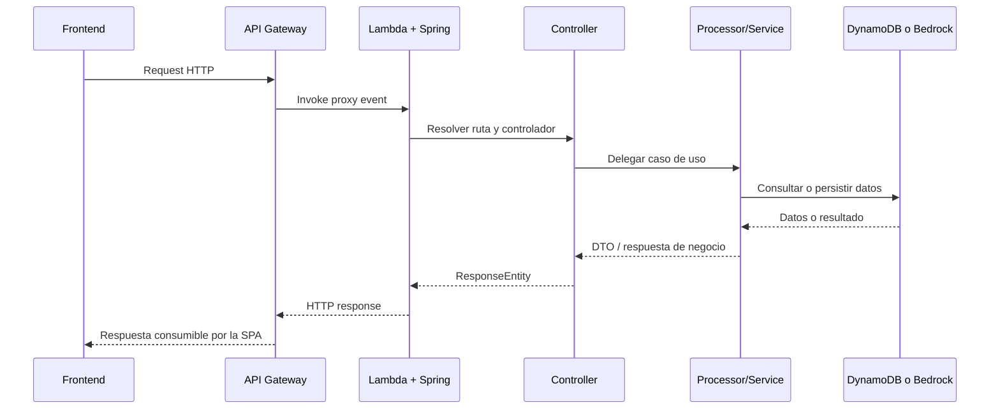
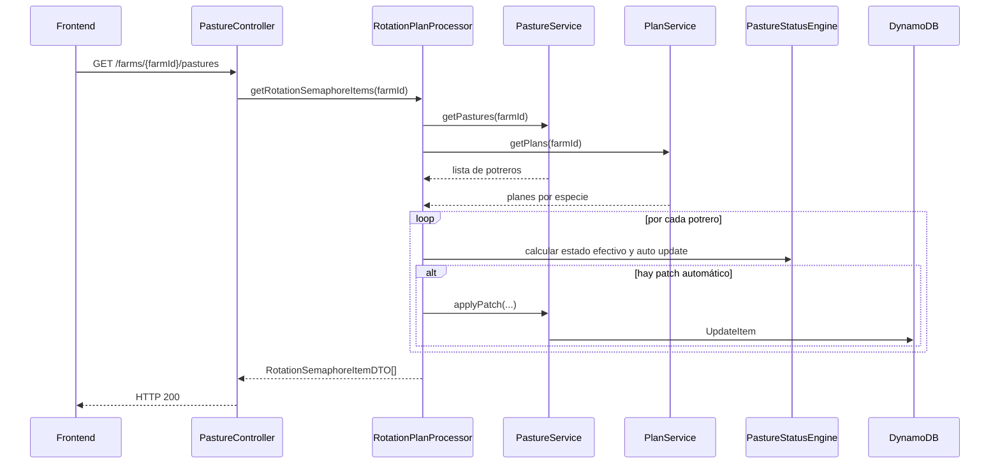

# Flujo de Negocio - lambda-aws-cattle-java

## Contexto

`lambda-aws-cattle-java` es el backend transaccional y de consulta del ecosistema cattle. Su función de negocio es recibir operaciones desde el frontend, aplicar reglas por dominio y responder con datos persistidos o derivados sobre bovinos, ordeño, potreros y chatbot.

Este documento describe el flujo de negocio observado en el código actual y en la arquitectura validada del backend.

## Evidencia revisada

- `src/main/java/com/cattle/StreamLambdaHandler.java`
- `src/main/java/com/cattle/controller/BovineController.java`
- `src/main/java/com/cattle/controller/MilkingController.java`
- `src/main/java/com/cattle/controller/PastureController.java`
- `src/main/java/com/cattle/controller/ChatbotController.java`
- `src/main/java/com/cattle/processor/BovineProcessor.java`
- `src/main/java/com/cattle/processor/RotationPlanProcessor.java`
- `src/main/resources/application.properties`
- `template.yml`

## Vista general del flujo

El backend sigue un flujo de negocio común para casi todos los dominios:

1. API Gateway entrega la request a la Lambda
2. `StreamLambdaHandler` la enruta a Spring Boot
3. el controlador valida y delega a un processor o servicio
4. la capa de negocio consulta o persiste en DynamoDB
5. se devuelve un DTO o respuesta específica del dominio

En chatbot, el flujo agrega seguridad, sanitización, rate limiting y auditoría antes de invocar Bedrock o la knowledge base.

## Flujo principal del backend

### 1. Entrada HTTP serverless

- API Gateway recibe la request REST.
- La Lambda única `cattle-lambda-function` procesa todas las rutas.
- `StreamLambdaHandler` adapta el evento serverless a la aplicación Spring.

Resultado de negocio: todos los dominios operan detrás de una sola superficie HTTP desplegada en AWS.

### 2. Resolución por controlador

Los controladores confirmados reparten la intención de negocio así:

- `BovineController`: CRUD operativo de bovinos
- `BovinesSummaryController`: vistas resumidas por bovino
- `MilkingController`: registro e historial de ordeños
- `PastureController`: consulta de semáforo de rotación por finca
- `ChatbotController`: conversación y consulta de conocimiento
- `PingController`: salud operativa

Resultado de negocio: la request queda asignada al dominio correcto sin mezclar reglas entre contextos.

### 3. Orquestación y reglas por dominio

#### Bovinos

Flujo observable:

1. el controlador recibe la operación CRUD
2. `BovineProcessor` delega a `BovineService`
3. se convierte entre entidad y DTO con MapStruct
4. el repositorio persiste o consulta identidad bovina en DynamoDB

Valor de negocio: mantener actualizado el inventario operativo de animales.

#### Ordeño

Flujo observable:

1. `MilkingController` recibe alta o consulta de producción
2. `MilkingProcessor` resuelve la operación
3. servicios y repositorios consultan o escriben información de ordeño
4. la respuesta vuelve como `MilkingDTO` o agregados de lactancias

Valor de negocio: registrar producción y reconstruir historial por animal y por lactancia.

#### Potreros

Flujo observable:

1. `PastureController` expone `GET /farms/{farmId}/pastures`
2. `RotationPlanProcessor` consulta potreros y planes de rotación
3. calcula ETA con `EtaCalculator`
4. aplica `PastureStatusEngine` para derivar estado efectivo
5. si detecta cambios automáticos, persiste un `EntityPatch`
6. devuelve `RotationSemaphoreItemDTO` ordenados por disponibilidad

Valor de negocio: transformar datos de potreros y planes en una vista operativa de rotación lista para consumo.

#### Chatbot

Flujo observable:

1. `ChatbotController` extrae `farmId` y `userId` del contexto de seguridad
2. valida autenticación mínima del request
3. aplica rate limiting por finca
4. sanitiza el input
5. delega a `ChatbotService` o `KnowledgeBaseService`
6. registra auditoría y devuelve respuesta al cliente

Valor de negocio: ofrecer una capa conversacional sobre datos de finca y conocimiento ganadero técnico.

## Secuencia resumida extremo a extremo

## Secuencia específica del flujo de potreros

## Responsabilidades por capa

### Adaptador serverless

- exponer una sola entrypoint Lambda
- reutilizar el runtime Spring para todas las rutas

### Controladores

- validar entrada básica
- traducir intención HTTP a caso de uso
- construir respuestas REST

### Processors y services

- ejecutar reglas de negocio
- coordinar repositorios, cálculos y servicios externos
- consolidar DTOs y errores de dominio

### Repositorios e integraciones

- persistir en DynamoDB por tabla y agregado
- invocar Bedrock o Knowledge Base en chatbot

## Riesgos y límites del flujo actual

- una sola Lambda concentra varios dominios y aumenta el peso del cold start
- la seguridad puede quedar desactivada por configuración
- parte de la infraestructura real depende de tablas y variables de entorno no modeladas en SAM
- el dominio de potreros hoy expone sobre todo lectura derivada, no un CRUD completo confirmado
- el chatbot es el flujo con más controles transversales y más dependencia externa

## Lectura recomendada

1. Leer este flujo para entender cómo el backend transforma requests en resultados de negocio.
2. Complementar con `architecture-cattle-lambda-function.md` para detalles estructurales y operativos.
3. Bajar luego a `eventos/` o `chatbot/` cuando el cambio afecte esos subsistemas.