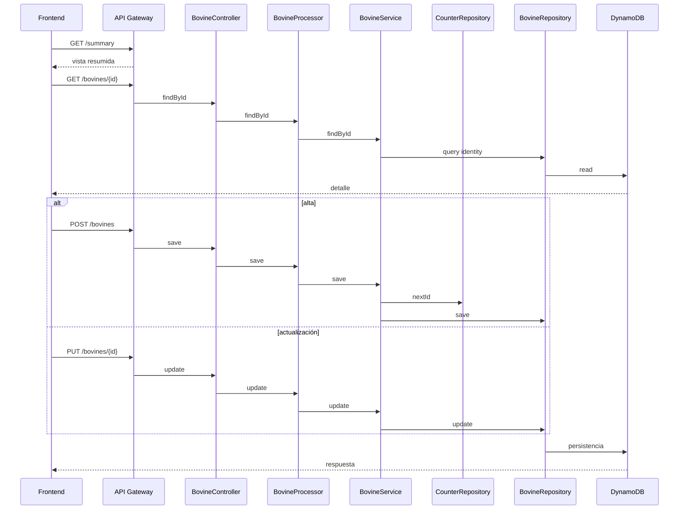

# Flujo Transversal - Gestión de Bovinos

## Contexto

Este documento describe el recorrido extremo a extremo del caso de uso de bovinos entre el frontend `cattle-front` y el backend `lambda-aws-cattle-java`.

El flujo combina una vista resumida de listado con operaciones transaccionales de lectura puntual, alta y actualización.

## Evidencia revisada

- `cattle-front/src/components/Bovines/list/BovineList.jsx`
- `cattle-front/src/components/Bovines/forms/AddBovine.jsx`
- `cattle-front/src/components/Bovines/forms/EditBovineWrapper.jsx`
- `cattle-front/src/components/Bovines/hooks/useBovineForm.ts`
- `src/main/java/com/cattle/controller/BovineController.java`
- `src/main/java/com/cattle/processor/BovineProcessor.java`
- `src/main/java/com/cattle/services/BovineService.java`
- `src/main/java/com/cattle/repository/BovineRepository.java`

## Pregunta de negocio que resuelve

El flujo responde operativamente:

`¿Cómo consulto, registro y actualizo animales del hato desde la SPA sin salir del dominio bovino?`

## Flujo extremo a extremo

### 1. Vista resumida de entrada

- El frontend consulta `/summary` para poblar la lista principal de bovinos.
- Esa superficie permite navegar rápidamente por el inventario visible.

Resultado: el usuario entra al dominio con una vista orientada a exploración y resumen.

### 2. Consulta puntual del bovino

- Para detalle o edición, el frontend consulta `GET /bovines/{id}`.
- `BovineController.findById` valida el ID y delega en `BovineProcessor.findById`.
- El processor usa `BovineService.findById`.
- `BovineRepository.findById` consulta DynamoDB con `PK = BOVINE#{id}` y `SK = IDENTITY`.

Resultado: el sistema devuelve la ficha puntual del animal seleccionada por el usuario.

### 3. Alta de un nuevo bovino

- El frontend envía `POST /bovines` con un `BovineDTO`.
- `BovineController.save` delega en `BovineProcessor.save`.
- El processor transforma el DTO a `BovineIdentityItem` y llama a `BovineService.save`.
- `BovineService` solicita el siguiente ID a `CounterRepository`.
- Luego completa claves de persistencia, GSI y timestamps.
- `BovineRepository.save` persiste el registro.

Resultado: el alta queda registrada como identidad bovina persistida en DynamoDB.

### 4. Actualización de un bovino existente

- El frontend envía `PUT /bovines/{id}` con el `bovineId` consistente en el body.
- `BovineController.update` valida esa consistencia.
- `BovineProcessor.update` transforma y delega en `BovineService.update`.
- `BovineService` verifica existencia previa, recompone claves y persiste la nueva versión.

Resultado: el bovino queda actualizado sin cambiar la identidad de persistencia.

## Diagrama resumido

## Qué aporta cada lado al negocio

### Frontend

- ofrece exploración resumida del inventario
- presenta formulario reutilizable para alta y edición
- permite detalle puntual por animal

### Backend

- valida y enruta operaciones CRUD básicas
- transforma contratos HTTP a identidad persistida en DynamoDB
- genera identificador en altas y conserva consistencia en actualizaciones

## Riesgos y límites observados

- la separación entre `/summary` y `/bovines` puede producir diferencias entre lo que se lista y lo que se edita
- el límite actual del repositorio en `findAll()` afecta la cantidad de bovinos visibles en una sola consulta
- los endpoints siguen acoplados a URLs hardcodeadas en el frontend

## Lectura recomendada

1. Leer este documento para ubicar el flujo transversal de bovinos.
2. Complementar con la arquitectura base del backend y del frontend.
3. Revisar `flujo-registro-bovino.md` solo como apoyo histórico normalizado.