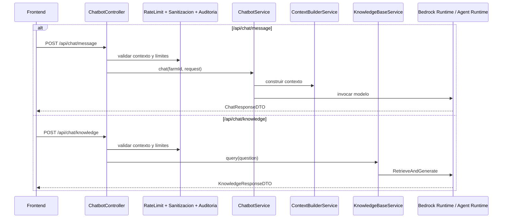

# Flujo Transversal - Chatbot

## Contexto

Este documento describe el recorrido extremo a extremo del chatbot entre el frontend `cattle-front` y el backend `lambda-aws-cattle-java`.

El flujo tiene dos rutas de negocio diferenciadas:

- conversación sobre datos de la finca
- consulta RAG sobre conocimiento técnico ganadero

## Evidencia revisada

- `cattle-front/src/components/AgroChat/ChatPanel/ChatPanel.jsx`
- `src/main/java/com/cattle/controller/ChatbotController.java`
- `src/main/java/com/cattle/services/chatbot/ChatbotService.java`
- `src/main/java/com/cattle/services/ContextBuilderService.java`
- `src/main/java/com/cattle/services/knowledge/KnowledgeBaseService.java`
- `src/main/java/com/cattle/config/SecurityConfig.java`
- `src/main/java/com/cattle/config/BedrockAgentConfig.java`

## Pregunta de negocio que resuelve

El flujo responde operativamente:

`¿Cómo obtiene el usuario respuestas sobre su finca o sobre conocimiento técnico usando un solo módulo conversacional?`

## Flujo extremo a extremo

### 1. Entrada desde frontend

- El frontend invoca `POST /api/chat/message` o `POST /api/chat/knowledge`.
- Ambos endpoints cuelgan de `ChatbotController`.

Resultado: una sola superficie HTTP concentra las dos variantes del producto conversacional.

### 2. Controles transversales en controlador

Antes de resolver la consulta, `ChatbotController` hace lo siguiente:

- extrae `farmId` y `userId` desde `SecurityContext`
- valida que existan credenciales mínimas
- aplica rate limiting por finca
- sanitiza el input
- registra auditoría de éxito o error

Resultado: el chatbot entra al flujo de IA con controles previos de seguridad y abuso.

### 3. Ruta `message`: chatbot sobre datos de finca

Cuando la request va a `/api/chat/message`:

1. `ChatbotController` delega en `ChatbotService.chat(farmId, request)`
2. `ChatbotService` detecta intención con `IntentDetectionService`
3. `ContextBuilderService` construye contexto usando servicios de bovinos, ordeño y potreros
4. se construye un prompt enriquecido
5. `BedrockService` invoca el modelo configurado
6. se devuelve `ChatResponseDTO` con respuesta, intención y duración

Resultado: el usuario obtiene una respuesta generada a partir del estado real de su finca.

### 4. Ruta `knowledge`: consulta RAG

Cuando la request va a `/api/chat/knowledge`:

1. `ChatbotController` delega en `KnowledgeBaseService.query(question)`
2. el servicio verifica si la Knowledge Base está configurada
3. construye un request `RetrieveAndGenerate`
4. invoca `BedrockAgentRuntimeClient`
5. parsea respuesta, citaciones, fuentes y categorías
6. devuelve `KnowledgeResponseDTO`

Resultado: el usuario recibe respuesta técnica más trazable, con fuentes asociadas cuando existen.

## Diagrama resumido

## Qué aporta cada lado al negocio

### Frontend

- ofrece una experiencia conversacional unificada
- permite alternar entre consulta operativa y consulta técnica
- traduce la respuesta backend a hilo, feedback y fuentes visibles

### Backend

- protege, limita y audita el uso del chatbot
- separa la ruta conversacional operativa de la ruta RAG
- integra servicios internos del dominio y servicios Bedrock externos

## Riesgos y límites observados

- `SecurityConfig` protege explícitamente `/api/chat/message`, pero no declara con la misma precisión `/api/chat/knowledge`
- la ruta `knowledge` depende de `BEDROCK_KB_ID`, que sigue siendo una dependencia crítica por ambiente
- el frontend no propaga de forma uniforme un token al módulo del chatbot
- la documentación del chatbot estaba centrada en arquitectura backend, no en journey transversal con la SPA

## Lectura recomendada

1. Leer este documento para entender el flujo transversal del chatbot.
2. Complementar con `chatbot/ARCHITECTURE.md` para la arquitectura detallada del backend.
3. Revisar `GUIA-INTEGRACION-CHATBOT-DYNAMODB.md` si cambia el contexto construido desde datos de finca.