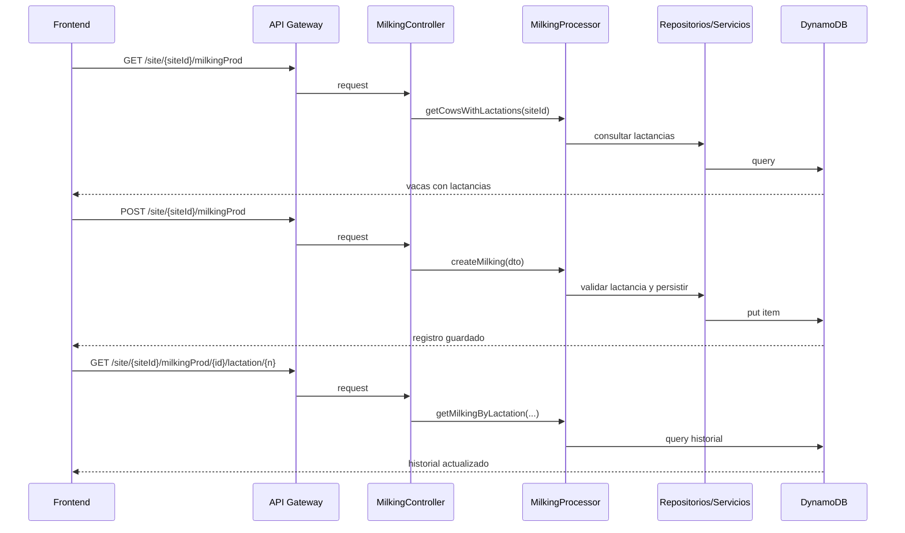

# Flujo Transversal - Registro y Consulta de Ordeño

## Contexto

Este documento describe el recorrido extremo a extremo del caso de uso de ordeño entre el frontend `cattle-front` y el backend `lambda-aws-cattle-java`.

La operación combina consulta de vacas con lactancias, registro de nuevos ordeños e historial por lactancia para análisis operativo.

## Evidencia revisada

- `cattle-front/src/components/MilkDashboard/MilkDashboardPage/MilkDashboardPage.jsx`
- `src/main/java/com/cattle/controller/MilkingController.java`
- `src/main/java/com/cattle/processor/MilkingProcessor.java`
- `src/main/java/com/cattle/services/MilkingService.java`
- `src/main/java/com/cattle/repository/ProfileLactancyRepository.java`

## Pregunta de negocio que resuelve

El flujo responde operativamente:

`¿Qué vacas están en lactancia, cuánto produjeron y cómo registro nuevos ordeños sin perder trazabilidad por lactancia?`

## Flujo extremo a extremo

### 1. Consulta base del dashboard de lactancia

- El frontend solicita `GET /site/{siteId}/milkingProd`.
- `MilkingController` delega en `MilkingProcessor.getCowsWithLactations(siteId)`.
- El processor consulta lactancias y agrupa por bovino.
- Devuelve `CowWithLactationsDTO` con sus lactancias activas e históricas.

Resultado: el frontend recibe el conjunto base para seleccionar bovinos productivos.

### 2. Consulta del historial por lactancia

- Cuando el usuario selecciona una vaca y una lactancia, el frontend invoca `GET /site/{siteId}/milkingProd/{idBovine}/lactation/{lactationNumber}`.
- `MilkingProcessor` consulta registros de ordeño asociados al bovino y a la lactancia solicitada.

Resultado: el módulo obtiene la serie necesaria para historia, tabla y curva.

### 3. Registro de un ordeño

- El frontend envía `POST /site/{siteId}/milkingProd` con un `MilkingDTO`.
- `MilkingController` valida el body y delega en `MilkingProcessor.createMilking`.
- El processor:
  - valida `bovineId`, fecha y turno
  - asigna PK y SK
  - busca la lactancia activa del bovino
  - asigna `lactationNumber` y claves GSI de consulta
- `MilkingService` persiste el registro.

Resultado: cada ordeño queda conectado tanto al bovino como a su lactancia activa.

### 4. Relectura y actualización del dashboard

- Tras un guardado exitoso, el frontend vuelve a consultar la lactancia seleccionada.
- La nueva respuesta actualiza historial y visualizaciones.

Resultado: el dashboard mantiene consistencia visual con el estado persistido en backend.

## Diagrama resumido

## Qué aporta cada lado al negocio

### Frontend

- concentra la captura diaria de litros
- presenta curva, historial y selección de vacas activas
- decide cuándo refrescar la información visible

### Backend

- garantiza que el ordeño se asigne a una lactancia activa válida
- estructura la persistencia para consulta por bovino y por lactancia
- devuelve agregados consumibles por la interfaz

## Riesgos y límites observados

- el journey depende de perfiles de lactancia bien mantenidos
- no se evidencia en esta pasada control transaccional batch; el frontend dispara múltiples registros individuales
- el `siteId` y otros valores operativos siguen hardcodeados en el cliente

## Lectura recomendada

1. Leer este documento para ubicar el flujo transversal de ordeño.
2. Complementar con la arquitectura base del backend para revisar capas y repositorios.
3. Revisar el frontend de lactancia si se van a cambiar visualizaciones o captura diaria.