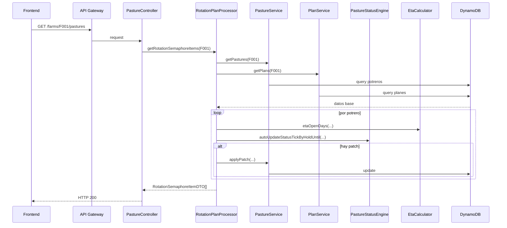

# Flujo Transversal - Consulta Operativa de Potreros

## Contexto

Este documento describe el recorrido extremo a extremo del caso de uso de potreros entre el frontend `cattle-front` y el backend `lambda-aws-cattle-java`.

El flujo parte de una pantalla operativa en React y termina en una respuesta calculada sobre DynamoDB, planes de rotación y reglas automáticas del motor de estado.

## Evidencia revisada

- `cattle-front/src/components/Paddock/page/PaddockPage.jsx`
- `src/main/java/com/cattle/controller/PastureController.java`
- `src/main/java/com/cattle/processor/RotationPlanProcessor.java`
- `src/main/java/com/cattle/services/PastureService.java`
- `src/main/java/com/cattle/services/PlanService.java`
- `src/main/java/com/cattle/utils/PastureStatusEngine.java`
- `src/main/java/com/cattle/utils/EtaCalculator.java`

## Pregunta de negocio que resuelve

El flujo responde operativamente:

`¿Qué potreros están listos para uso, cuáles siguen en descanso y cuándo se habilitarán?`

Para responderla, el sistema no se limita a listar registros; construye una vista derivada de rotación.

## Flujo extremo a extremo

### 1. Disparo desde frontend

- El usuario entra al dashboard `/potreros`.
- `PaddockPage.jsx` dispara `GET https://.../Prod/farms/F001/pastures`.

Resultado: el frontend solicita una vista operativa completa, no un recurso mínimo por potrero.

### 2. Entrada HTTP en la Lambda

- API Gateway recibe la request y la envía a la Lambda única.
- `StreamLambdaHandler` delega el enrutamiento a Spring Boot.
- `PastureController` recibe `GET /farms/{farmId}/pastures`.

Resultado: el backend identifica el dominio de rotación como responsable de la respuesta.

### 3. Orquestación del caso de uso

`RotationPlanProcessor` ejecuta la lógica de negocio principal:

1. obtiene los potreros de la finca
2. obtiene los planes de rotación de la misma finca
3. asocia cada potrero con su plan por especie
4. calcula ETA de apertura con `EtaCalculator`
5. pide a `PastureStatusEngine` el estado efectivo y posibles autoajustes
6. aplica `EntityPatch` sobre persistencia cuando hay correcciones automáticas
7. arma un `RotationSemaphoreItemDTO` por potrero
8. ordena la colección por ETA

Resultado: la respuesta final ya incorpora cálculo de negocio y no solo lectura persistida.

### 4. Persistencia y enriquecimiento

Durante el flujo, el backend consulta:

- tabla de potreros
- tabla de planes

Y puede además persistir cambios derivados cuando el motor detecta que el estado debe autoactualizarse.

Resultado: el flujo es de consulta enriquecida con posibilidad de corrección automática del estado persistido.

### 5. Renderizado final en frontend

El frontend consume la respuesta y la reutiliza para:

- KPIs de superficie y disponibilidad
- tabla de potreros
- semáforo de rotación
- detalle del potrero seleccionado
- filtros locales por especie, estado y búsqueda

Resultado: una sola llamada backend alimenta la pantalla operativa principal del dominio de potreros.

## Diagrama resumido

## Qué aporta cada lado al negocio

### Frontend

- inicia la consulta del dashboard
- concentra filtros e interacción del usuario
- muestra el estado operativo en formato accionable

### Backend

- resuelve reglas de rotación
- calcula ETA y estado efectivo
- mantiene coherencia del estado derivado
- entrega un DTO listo para consumo visual

## Riesgos y límites observados

- el `farmId` del frontend está acoplado a `F001`
- el frontend presenta todavía señales de prototipo en copy y comportamiento
- la API de potreros confirmada es principalmente de lectura enriquecida
- una consulta aparentemente simple puede disparar lógica relevante de negocio y persistencia

## Lectura recomendada

1. Leer este documento para ubicar el caso de uso transversal.
2. Revisar `architecture-cattle-lambda-function.md` para entender capas y restricciones del backend.
3. Revisar `eventos/` si se quiere profundizar en `EntityPatch` y derivación de estado.