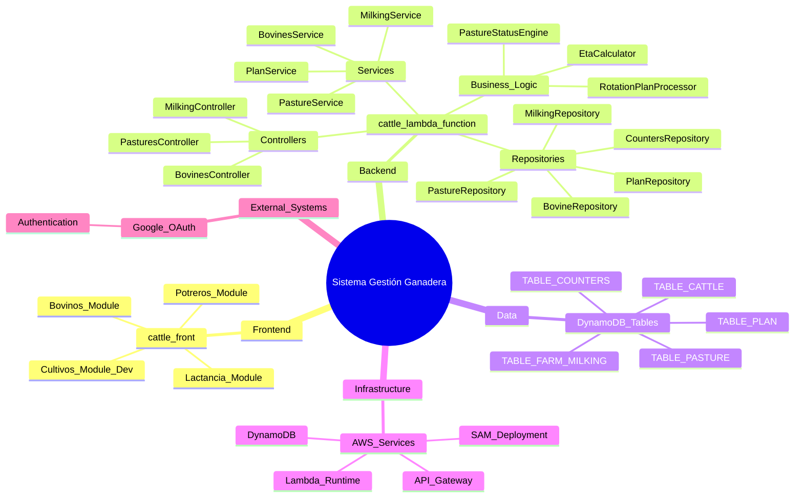
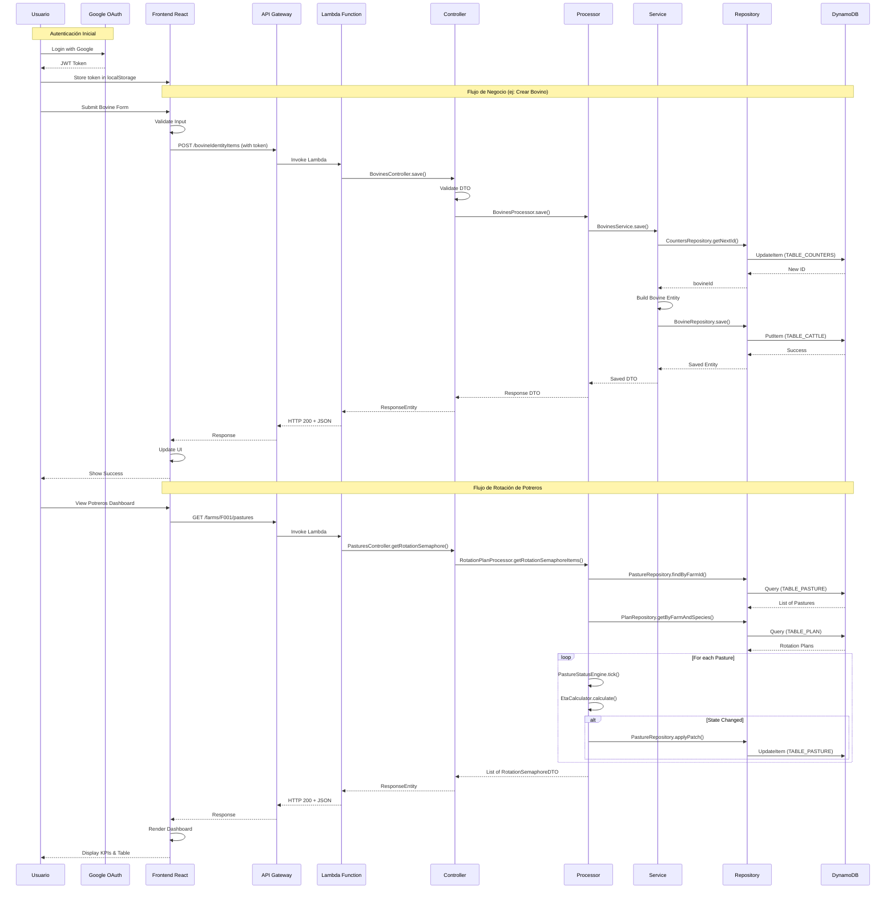

# Arquitectura del Sistema - GPS Principal

Este documento sirve como **GPS arquitectónico** para navegar el ecosistema y guiar el desarrollo cuando lleguen nuevas historias de usuario.

## 🎯 **Visión General del Sistema**

### Propósito Principal

Sistema de gestión ganadera integral diseñado para administrar fincas ganaderas, incluyendo:
- **Gestión de bovinos:** Control completo de ejemplares (vacas, terneros, toros, novillas)
- **Lactancia:** Registro y seguimiento de producción láctea por bovino
- **Rotación de potreros:** Gestión inteligente de especies forrajeras y pastoreo
- **Cultivos:** Módulo para gestión de frutales (en desarrollo)
- **Sanidad animal:** Vacunas, desparasitación, tratamientos (planificado)

El sistema permite optimizar la producción ganadera mediante trazabilidad completa, automatización de rotación de potreros, y registro sistemático de producción.

### Distribución del Ecosistema

- **Total de repositorios identificados**: 2
- **Dominios/módulos principales**: Frontend (Web) y Backend (Serverless)
- **Repositorios críticos**:
  1. **cattle-front** - Aplicación web React para usuarios finales
  2. **cattle-lambda-function** - API serverless Java en AWS Lambda

### Diagrama de Arquitectura de Alto Nivel

```mermaid
graph TB
    subgraph "Sistemas Externos"
        EXT1[Google OAuth - Autenticación]
        EXT2[AWS Services]
    end

    subgraph "Frontend Layer"
        WEB[Web App React<br/>cattle-front<br/>Vite + React 19 + TailwindCSS]
    end

    subgraph "API Layer"
        APIGW[AWS API Gateway<br/>REST Proxy /{proxy+}]
    end

    subgraph "Backend Layer - Serverless"
        LAMBDA[AWS Lambda Function<br/>Java 21 + Spring Boot<br/>cattle-lambda-function]
    end

    subgraph "Services Layer"
        BOVINE_SVC[Bovines Service]
        MILK_SVC[Milking Service]
        PASTURE_SVC[Pasture Service]
        PLAN_SVC[Plan Service]
    end

    subgraph "Data Layer"
        DDB_BOVINE[(DynamoDB<br/>TABLE_CATTLE)]
        DDB_MILK[(DynamoDB<br/>TABLE_FARM_MILKING)]
        DDB_PASTURE[(DynamoDB<br/>TABLE_PASTURE)]
        DDB_PLAN[(DynamoDB<br/>TABLE_PLAN)]
        DDB_COUNTER[(DynamoDB<br/>TABLE_COUNTERS)]
    end

    subgraph "Business Logic"
        ENGINE[PastureStatusEngine<br/>Motor de Rotación]
        ETA[EtaCalculator<br/>Cálculo de Disponibilidad]
    end

    %% Flujo de datos
    WEB -->|HTTPS| APIGW
    APIGW -->|Invoca| LAMBDA
    LAMBDA -->|Ejecuta| BOVINE_SVC
    LAMBDA -->|Ejecuta| MILK_SVC
    LAMBDA -->|Ejecuta| PASTURE_SVC
    LAMBDA -->|Ejecuta| PLAN_SVC

    BOVINE_SVC -->|Read/Write| DDB_BOVINE
    BOVINE_SVC -->|Get NextID| DDB_COUNTER
    MILK_SVC -->|Read/Write| DDB_MILK
    PASTURE_SVC -->|Read/Write| DDB_PASTURE
    PASTURE_SVC -->|Usa| ENGINE
    PASTURE_SVC -->|Usa| ETA
    PLAN_SVC -->|Read/Write| DDB_PLAN

    %% Integraciones externas
    WEB -->|Autenticación| EXT1
    LAMBDA -.->|Infraestructura| EXT2

    classDef frontend fill:#e1f5fe,stroke:#01579b,stroke-width:2px
    classDef api fill:#fff3e0,stroke:#e65100,stroke-width:2px
    classDef backend fill:#f3e5f5,stroke:#4a148c,stroke-width:2px
    classDef data fill:#e8f5e8,stroke:#1b5e20,stroke-width:2px
    classDef external fill:#ffebee,stroke:#b71c1c,stroke-width:2px
    classDef logic fill:#e0f2f1,stroke:#004d40,stroke-width:2px

    class WEB frontend
    class APIGW api
    class LAMBDA backend
    class BOVINE_SVC,MILK_SVC,PASTURE_SVC,PLAN_SVC backend
    class DDB_BOVINE,DDB_MILK,DDB_PASTURE,DDB_PLAN,DDB_COUNTER data
    class EXT1,EXT2 external
    class ENGINE,ETA logic
```

## 🗂️ **Mapa de Repositorios por Dominio**

### Frontend Web

- **Repositorio**: `cattle-front`
- **Stack principal**: React 19, Vite 7, TailwindCSS 3, React Router DOM 7
- **Función**: Interfaz de usuario para gestión completa de la finca ganadera
- **Estado**: ✅ Activo - Módulos core implementados (Bovinos, Lactancia, Potreros)
- **Ubicación**: `/cattle-front`

### Backend Serverless

- **Repositorio**: `cattle-lambda-function`
- **Stack principal**: Java 21, Spring Boot, AWS Lambda, DynamoDB Enhanced Client
- **Función**: API REST serverless para toda la lógica de negocio y persistencia
- **Estado**: ✅ Activo - Endpoints implementados para módulos core
- **Ubicación**: `/cattle-lambda-function`

### Mapa Visual de Repositorios



## ⚙️ **Stack Tecnológico Global**

### Tecnologías Principales Identificadas

#### Frontend (cattle-front)
- **Lenguaje**: JavaScript/TypeScript (mixto)
- **Framework**: React 19.1.0
- **Build Tool**: Vite 7.0.4
- **Routing**: React Router DOM 7.7.1
- **Styling**: TailwindCSS 3.4.3
- **HTTP Client**: Axios 1.11.0
- **Autenticación**: @react-oauth/google 0.12.2
- **Linting**: ESLint 9.30.1

#### Backend (cattle-lambda-function)
- **Lenguaje**: Java 21
- **Framework**: Spring Boot (AWS Serverless Java Container)
- **Runtime**: AWS Lambda
- **Base de datos**: DynamoDB (Enhanced Client)
- **Build Tool**: Gradle + Maven
- **Testing**: JUnit
- **Deployment**: AWS SAM (Serverless Application Model)
- **Utilities**: Lombok (reducción de boilerplate)

#### Infraestructura AWS
- **API Gateway**: REST API con proxy `/{proxy+}`
- **Lambda**: 512MB RAM, 30s timeout, Java 21 runtime
- **DynamoDB**: 5 tablas principales con GSI (Global Secondary Indexes)
- **Region**: us-east-1
- **Stage**: dev

### Patrones Arquitectónicos Detectados

#### 1. **Serverless Architecture**
Arquitectura completamente serverless en AWS para reducir costos operativos y escalabilidad automática. No hay servidores que administrar.

#### 2. **API Gateway Proxy Pattern**
API Gateway configurado con proxy completo `/{proxy+}` que redirige todas las rutas a Lambda, permitiendo que Spring Boot maneje el routing interno.

#### 3. **Single Table Design (DynamoDB)**
Uso de tablas DynamoDB con GSIs para diferentes patrones de acceso, optimizando costos y performance.

#### 4. **Repository Pattern**
Capa de repositorios que abstrae el acceso a DynamoDB, facilitando testing y mantenimiento.

#### 5. **Service Layer Pattern**
Capa de servicios que contiene lógica de negocio, separada de controllers y repositories.

#### 6. **Processor Pattern**
Capa de procesadores que orquesta operaciones complejas entre múltiples servicios (ej: RotationPlanProcessor).

#### 7. **Domain-Driven Design (Light)**
Organización del código por dominios de negocio (Bovines, Milking, Pastures, Plans).

#### 8. **Event-Driven State Machine**
Motor de estados para potreros que procesa eventos (OPEN, CLOSE, MAINTENANCE_SET, etc.) y actualiza estados automáticamente.

#### 9. **Client-Side Routing (SPA)**
Frontend React con enrutamiento del lado del cliente usando React Router.

#### 10. **Protected Routes Pattern**
Componente `RequireAuth` que protege rutas privadas verificando token de Google OAuth.

## 🔗 **Puntos de Integración Críticos**

### APIs Internas

#### API REST Principal
- **Endpoint Base**: `https://xi0ygax4hg.execute-api.us-east-1.amazonaws.com/dev`
- **Protocolo**: HTTP/REST
- **Autenticación**: Google OAuth token (almacenado en localStorage)
- **Formato**: JSON

**Endpoints Implementados:**

| Método | Ruta | Descripción | Usado por |
|--------|------|-------------|-----------|
| GET | `/bovineIdentityItems` | Listar todos los bovinos | BovineList.jsx |
| GET | `/bovineIdentityItems/{id}` | Obtener bovino específico | BovineDetail.jsx |
| POST | `/bovineIdentityItems` | Crear nuevo bovino | AddBovine.jsx |
| PUT | `/bovineIdentityItems/{id}` | Actualizar bovino | EditBovineWrapper.jsx |
| GET | `/milkingRecord/{bovineId}?shift=AM\|PM` | Consultar lactancia por bovino | MilkingTable.jsx |
| POST | `/milkingRecord` | Registrar ordeño | MilkingAdd.jsx |
| GET | `/farms/{farmId}/pastures` | Estado rotación potreros | PaddockPage.jsx |

### Bases de Datos Compartidas

Cada servicio tiene su tabla dedicada en DynamoDB:

- **TABLE_CATTLE**: Usado exclusivamente por BovineRepository
- **TABLE_FARM_MILKING**: Usado exclusivamente por MilkingRepository
- **TABLE_PASTURE**: Usado exclusivamente por PastureRepository
- **TABLE_PLAN**: Usado exclusivamente por PlanRepository
- **TABLE_COUNTERS**: Compartida por todos los servicios para generación de IDs auto-incrementales

**Patrón de acceso:**
```
Service → Repository → DynamoDB Enhanced Client → DynamoDB Table
```

### Sistemas de Mensajería/Eventos

No se identificaron sistemas de mensajería externos (SQS, SNS, EventBridge). 

**Sistema de eventos interno:**
- **PastureStatusEngine**: Motor de eventos para cambios de estado de potreros
- **Eventos soportados**: OPEN, CLOSE, MAINTENANCE_SET, MAINTENANCE_CLEAR
- **Implementación**: Event classes en `com.cattle.events.*`

## 🔐 **Patrones de Integración y Seguridad**

### Canales de Comunicación Identificados

| Canal | Protocolo | Sistemas Participantes | Monitoreo/Logging | Estado |
|-------|-----------|------------------------|-------------------|--------|
| Frontend → API Gateway | HTTPS/REST | Web App → API Gateway | API Gateway Logs | ✅ Activo |
| API Gateway → Lambda | AWS Proxy Integration | API Gateway → Lambda Function | CloudWatch Logs | ✅ Activo |
| Lambda → DynamoDB | AWS SDK/Enhanced Client | Lambda Services → DynamoDB Tables | CloudWatch Logs + DynamoDB Metrics | ✅ Activo |
| Frontend → Google OAuth | OAuth 2.0 | Web App → Google Identity | Google OAuth Logs | ✅ Activo |

### Mecanismos de Autenticación/Autorización por Capa

#### Capa de Frontend
- **Autenticación**: Google OAuth 2.0 con `@react-oauth/google`
- **Client ID**: `5223353390-vk8puj6horev9ie6fsn038vdffngr4ju.apps.googleusercontent.com`
- **Storage**: Token JWT almacenado en `localStorage` con key `google_token`
- **Guard**: Componente `RequireAuth` verifica existencia de token antes de renderizar rutas protegidas
- **Autorización**: No implementada - todas las rutas accesibles si está autenticado

#### Capa de API Gateway
- **Autenticación**: Sin validación de token (confianza implícita en frontend)
- **Autorización**: Sin restricciones - proxy completo a Lambda
- **CORS**: Configurado para permitir requests del frontend
- **Throttling**: Límites por defecto de AWS API Gateway

#### Capa de Lambda/Backend
- **Autenticación**: Sin verificación de tokens Google OAuth en backend
- **Autorización**: Sin implementación de roles o permisos
- **Validación**: Validaciones básicas de datos en controllers
- **Security Headers**: Manejados por Spring Boot

#### Capa de Base de Datos
- **Autenticación**: AWS IAM Role asociado a Lambda Function
- **Autorización**: Permisos IAM para operaciones CRUD en tablas DynamoDB
- **Encriptación**: DynamoDB encryption at rest (configuración AWS)
- **Network Security**: VPC no configurado (Lambda en red pública AWS)

### Patrones de Resilencia Detectados

**⚠️ Nota**: No se identificaron patrones de resilencia implementados explícitamente.

**Gaps detectados:**
- **Circuit Breakers**: No implementados
- **Retry Policies**: Relies por defecto de AWS SDK (no personalizados)
- **Timeouts**: Timeout de Lambda en 30s (configurado), sin timeouts personalizados en HTTP clients
- **Fallbacks**: No hay mecanismos de fallback ante fallos
- **Rate Limiting**: Solo límites por defecto de API Gateway

**Resilencia implícita de AWS:**
- ✅ Lambda auto-scaling
- ✅ DynamoDB auto-scaling
- ✅ API Gateway alta disponibilidad
- ✅ Multi-AZ deployment automático

### Flujos de negocio críticos

#### Flujo 1: Gestión de Bovinos
**Descripción**: CRUD completo de ejemplares bovinos con genealogía y trazabilidad

**Componentes involucrados**:
```
BovineList.jsx → fetch() → API Gateway → Lambda → BovinesController 
→ BovinesProcessor → BovinesService → BovineRepository → DynamoDB TABLE_CATTLE
```

#### Flujo 2: Registro de Lactancia
**Descripción**: Registro de producción láctea por bovino y turno (AM/PM)

**Componentes involucrados**:
```
MilkingAdd.jsx → fetch() → API Gateway → Lambda → MilkingController 
→ MilkingProcessor → MilkingService → MilkingRepository → DynamoDB TABLE_FARM_MILKING
```

#### Flujo 3: Rotación Inteligente de Potreros
**Descripción**: Cálculo automático de estado y disponibilidad de potreros con motor de rotación

**Componentes involucrados**:
```
PaddockPage.jsx → fetch() → API Gateway → Lambda → PasturesController 
→ RotationPlanProcessor → PastureService + PlanService 
→ PastureStatusEngine + EtaCalculator 
→ PastureRepository + PlanRepository → DynamoDB (TABLE_PASTURE + TABLE_PLAN)
```

**Lógica especial**: 
- Motor ejecuta "tick" automático en cada consulta
- Calcula ETA (días hasta disponibilidad)
- Aplica cambios de estado automáticos
- Actualiza DynamoDB con patches si hay cambios

### Monitoreo de Integraciones

#### Verificación de salud de APIs

```bash
# Health check del API Gateway + Lambda
curl https://44xpamzadd.execute-api.us-east-1.amazonaws.com/Prod/ping

# Verificar endpoint de bovinos
curl https://44xpamzadd.execute-api.us-east-1.amazonaws.com/Prod/bovineIdentityItems
```

#### Logs de integración

```bash
# Ver logs de Lambda en CloudWatch (requiere AWS CLI configurado)
aws logs tail /aws/lambda/CattleBovinesFunctionsAwsFunction --follow --region us-east-1

# Ver logs de API Gateway
aws logs tail API-Gateway-Execution-Logs_<api-id>/dev --follow --region us-east-1
```

#### Métricas de performance

```bash
# Métricas de Lambda (requiere AWS CLI)
aws cloudwatch get-metric-statistics \
  --namespace AWS/Lambda \
  --metric-name Duration \
  --dimensions Name=FunctionName,Value=CattleBovinesFunctionsAwsFunction \
  --start-time 2025-12-01T00:00:00Z \
  --end-time 2025-12-01T23:59:59Z \
  --period 3600 \
  --statistics Average,Maximum \
  --region us-east-1
```

### Diagrama de Flujo de Integraciones



## 🧪 **Realidad de Testing Actual**

### Cobertura por Módulo

#### Frontend (cattle-front)
- **Estado**: ❌ Sin tests automatizados
- **Unit Tests**: No implementados
- **Integration Tests**: No implementados
- **E2E Tests**: No implementados
- **Coverage**: 0%
- **Nota**: No hay configuración de testing framework (Jest, Vitest, etc.)

#### Backend (cattle-lambda-function)
- **Estado**: ⚠️ Tests básicos implementados
- **Unit Tests**: ✅ Parcialmente implementado (JUnit)
- **Integration Tests**: ❌ No implementados
- **E2E Tests**: ❌ No implementados
- **Coverage**: ~20-30% estimado (no medida formalmente)
- **Tests existentes identificados**:
  - `StreamLambdaHandlerTest.java`
  - `BovinesControllerTest.java`
  - `PastureRepositoryTest.java`
  - `PastureStatusEngineTest.java`
  - `EtaCalculatorTest.java`

### Comandos de Testing Identificados

#### Tests por módulo específico

**Backend (cattle-lambda-function):**
```bash
# Ejecutar todos los tests con Gradle
cd cattle-lambda-function
./gradlew test

# Ejecutar tests con Maven
mvn test

# Ejecutar tests con reporte de coverage (si está configurado)
./gradlew test jacocoTestReport
```

**Frontend (cattle-front):**
```bash
# No hay comandos de testing configurados
# Para implementar, se recomienda:
npm install --save-dev vitest @testing-library/react @testing-library/jest-dom
# Luego ejecutar: npm run test
```

#### Tests de integración cross-sistema

```bash
# No implementados actualmente
# Recomendación: Implementar tests de integración con SAM Local
sam local start-api
# Luego ejecutar scripts de testing contra localhost:3000
```

#### Tests de regresión completa

```bash
# No implementados
# Recomendación: Implementar suite de tests E2E con Cypress o Playwright
```

### Tipos de Testing por Módulo

| Módulo | Unitarios | Integración | E2E | Performance | Security |
|--------|-----------|-------------|-----|-------------|----------|
| cattle-front (Frontend) | ❌ Ninguno | ❌ Ninguno | ❌ Ninguno | ❌ Ninguno | ❌ Ninguno |
| cattle-lambda-function (Backend) | ⚠️ Parcial (JUnit) | ❌ Ninguno | ❌ Ninguno | ❌ Ninguno | ❌ Ninguno |
| PastureStatusEngine | ✅ JUnit Tests | ❌ Ninguno | N/A | ❌ Ninguno | N/A |
| EtaCalculator | ✅ JUnit Tests | ❌ Ninguno | N/A | ❌ Ninguno | N/A |

### Gaps Críticos de Testing Detectados

1. **Frontend sin coverage**: Aplicación React completa sin ningún test automatizado
2. **APIs sin tests de integración**: Endpoints REST no validados automáticamente
3. **Flow E2E no validado**: Flujos completos usuario → backend → DB sin tests automáticos
4. **DynamoDB interactions**: Repositorios con tests mínimos, no hay mocks consistentes
5. **Motor de rotación**: Lógica crítica del PastureStatusEngine con tests básicos pero sin validación de escenarios complejos
6. **Autenticación no testeada**: Google OAuth integration sin tests
7. **Performance no medido**: Sin tests de carga para endpoints críticos
8. **Security sin validar**: Sin tests de penetración o validación de seguridad

## ⚠️ **Deuda Técnica y Restricciones**

### Componentes con Deuda Técnica

#### Frontend (cattle-front)
1. **Mezcla JavaScript/TypeScript**: Algunos archivos en `.ts`, otros en `.js`, crear inconsistencia
2. **URLs hardcodeadas**: Endpoints de API repetidos en múltiples archivos sin centralización
3. **Token en localStorage**: Vulnerable a XSS attacks, considerar httpOnly cookies
4. **Sin gestión de estado global**: Estado local en componentes puede escalar mal
5. **Componentes grandes**: Algunos componentes (PaddockPage) con muchas responsabilidades
6. **Sin error boundaries**: Errores no manejados globalmente

#### Backend (cattle-lambda-function)
1. **Validación de tokens inexistente**: Backend no valida tokens Google OAuth
2. **Sin autorización**: No hay roles, permisos, o control de acceso
3. **Timeouts no optimizados**: Lambda con 30s timeout genérico, no ajustado por endpoint
4. **Sin retry policies personalizados**: Usa defaults de AWS SDK
5. **Logging básico**: Logs inconsistentes, sin structured logging
6. **Gestión de preñez incompleta**: Entidad `Pregnancy.java` existe pero sin controller/endpoints
7. **Eventos de potreros sin endpoints**: Clases de eventos (OpenEvent, CloseEvent) sin APIs para ejecutarlos

### Restricciones Técnicas Conocidas

1. **Cold Start de Lambda**: Primera invocación puede tomar 3-5 segundos (Java 21)
2. **DynamoDB Capacity**: Sin auto-scaling configurado explícitamente
3. **API Gateway Timeout**: Máximo 29 segundos (restricción de AWS)
4. **Tamaño de Response**: Payload máximo 6MB en API Gateway
5. **Concurrent Executions**: Sin límite de concurrencia configurado en Lambda
6. **CORS**: Configurado pero sin especificación de orígenes permitidos
7. **Sin VPC**: Lambda en red pública, no hay aislamiento de red

### Workarounds Temporales

1. **Autenticación solo en frontend**: Backend confía en que frontend validó usuario correctamente
2. **IDs auto-incrementales en DynamoDB**: Uso de tabla de contadores para simular auto-increment (no nativo en DynamoDB)
3. **Tick manual en rotación**: Motor de rotación ejecuta "tick" en cada consulta GET en lugar de proceso programado
4. **Sin caché**: Cada consulta va directo a DynamoDB sin capa de caché (Redis)
5. **Módulos futuros en Sidebar**: Links a módulos no implementados (Sanidad, Insumos, Inventario, Raciones)

## 📦 **Dependencias Externas Críticas**

### Dependencias Principales por Módulo

#### Frontend (cattle-front)
**Dependencias de producción:**
- React 19.1.0 (framework principal)
- React DOM 19.1.0
- React Router DOM 7.7.1 (routing)
- @react-oauth/google 0.12.2 (autenticación)
- Axios 1.11.0 (HTTP client)

**Dependencias de desarrollo:**
- Vite 7.0.4 (build tool)
- TailwindCSS 3.4.3 (styling)
- ESLint 9.30.1 (linting)
- @vitejs/plugin-react 4.6.0

#### Backend (cattle-lambda-function)
**Dependencias principales:**
- Java 21 (runtime)
- Spring Boot 2.7.x (framework, via aws-serverless-java-container)
- AWS Serverless Java Container 2.1.4+ (Spring Boot en Lambda)
- AWS SDK for Java 2.x (DynamoDB Enhanced Client)
- Lombok (code generation)
- JUnit 5 (testing)

**Herramientas de build:**
- Gradle (primary)
- Maven (alternative)
- AWS SAM CLI (deployment)

### Análisis de Riesgo de Dependencias

| Dependencia | Versión Actual | Última Versión | Riesgo | Módulos Afectados | Notas |
|-------------|----------------|----------------|--------|-------------------|-------|
| React | 19.1.0 | 19.1.0 | 🟢 Bajo | Frontend | Actualizado |
| React Router DOM | 7.7.1 | 7.7.1 | 🟢 Bajo | Frontend | Actualizado |
| Vite | 7.0.4 | 7.0.4 | 🟢 Bajo | Frontend | Actualizado |
| Java | 21 | 21 (LTS) | 🟢 Bajo | Backend | LTS actualizado |
| Spring Boot | ~2.7.x | 3.3.x | 🟡 Medio | Backend | Versión no explícita, puede estar desactualizada |
| AWS SDK Java | 2.x | 2.29.x | 🟢 Bajo | Backend | Versión gestionada por AWS Lambda runtime |
| axios | 1.11.0 | 1.11.0 | 🟢 Bajo | Frontend | Actualizado |
| TailwindCSS | 3.4.3 | 3.4.17 | 🟡 Bajo | Frontend | Minor version detrás |

### Dependencias con Vulnerabilidades Conocidas

**Estado actual**: No se identificaron vulnerabilidades críticas conocidas en las dependencias principales.

**Recomendaciones**:
```bash
# Frontend - Auditoría de seguridad
cd cattle-front
npm audit

# Backend - Auditoría de dependencias
cd cattle-lambda-function
./gradlew dependencyCheckAnalyze
```

### Dependencias Críticas para el Ecosistema

#### Sistemas Internos Compartidos

- **DynamoDB Tables**: 5 tablas compartidas entre servicios, punto único de fallo para persistencia
- **TABLE_COUNTERS**: Tabla crítica para generación de IDs auto-incrementales, usada por todos los servicios de creación

#### Sistemas Externos y Servicios de Terceros

**Proveedores de autenticación:**
- **Google OAuth**: Único método de autenticación, sin fallback. Si Google OAuth falla, el sistema es inaccesible.
  - Client ID: `5223353390-vk8puj6horev9ie6fsn038vdffngr4ju.apps.googleusercontent.com`
  - Dominio: `accounts.google.com`

**Servicios AWS:**
- **API Gateway**: Punto de entrada único, región us-east-1
- **Lambda**: Función serverless principal, región us-east-1
- **DynamoDB**: Base de datos primaria, región us-east-1
- **CloudWatch**: Logging y monitoring
- **IAM**: Autenticación y autorización de servicios AWS

**Nota**: Todo el sistema depende de disponibilidad de AWS región us-east-1. Sin multi-región configurada.

## 🔧 **Comandos de Desarrollo Esenciales**

### Setup Inicial

#### Frontend (cattle-front)

```bash
# Configuración inicial del workspace
cd cattle-front

# Instalación de dependencias
npm install

# Configuración de variables de entorno (crear .env si es necesario)
# VITE_API_BASE_URL=https://xi0ygax4hg.execute-api.us-east-1.amazonaws.com/dev
```

#### Backend (cattle-lambda-function)

```bash
# Configuración inicial del workspace
cd cattle-lambda-function

# Instalación de dependencias con Gradle
./gradlew build

# O con Maven
mvn clean install

# Configurar AWS CLI (requerido para deployment)
aws configure
# AWS Access Key ID: [your-access-key]
# AWS Secret Access Key: [your-secret-key]
# Default region name: us-east-1
# Default output format: json

# Instalar SAM CLI (si no está instalado)
# Windows: choco install aws-sam-cli
# Mac: brew install aws-sam-cli
# Linux: pip install aws-sam-cli
```

### Desarrollo Diario

#### Frontend

```bash
# Iniciar servidor de desarrollo (hot reload)
cd cattle-front
npm run dev
# Disponible en: http://localhost:5173

# Build de producción
npm run build

# Preview de build de producción
npm run preview

# Linting
npm run lint
```

#### Backend

```bash
# Build completo del ecosistema
cd cattle-lambda-function
./gradlew build

# O con Maven
mvn clean package

# Ejecutar tests
./gradlew test

# Iniciar API local con SAM (testing local)
sam local start-api
# Disponible en: http://127.0.0.1:3000

# Invocar función Lambda localmente
sam local invoke CattleBovinesFunctionsAwsFunction -e events/event.json

# Build con SAM
sam build
```

### Deployment

```bash
# Deploy backend a AWS
cd cattle-lambda-function

# Primera vez (guided deployment)
sam deploy --guided

# Deployments subsecuentes
sam deploy

# Deploy frontend (configurar hosting - ej: S3 + CloudFront, Vercel, Netlify)
cd cattle-front
npm run build
# Subir contenido de /dist a hosting
```

### Debugging Cross-Sistema

```bash
# Logs de Lambda en tiempo real
aws logs tail /aws/lambda/CattleBovinesFunctionsAwsFunction --follow --region us-east-1

# Ver últimos errores de Lambda
aws logs filter-pattern /aws/lambda/CattleBovinesFunctionsAwsFunction --filter-pattern "ERROR" --region us-east-1

# Monitoreo de DynamoDB
aws dynamodb describe-table --table-name TABLE_CATTLE --region us-east-1

# Métricas de API Gateway
aws cloudwatch get-metric-statistics \
  --namespace AWS/ApiGateway \
  --metric-name Count \
  --dimensions Name=ApiName,Value=CattleBovinesFunctionsAwsApi \
  --start-time 2025-12-01T00:00:00Z \
  --end-time 2025-12-01T23:59:59Z \
  --period 3600 \
  --statistics Sum \
  --region us-east-1
```

## 📋 **Archivos de Referencia Rápida**

### Documentación Existente Encontrada

#### Frontend (cattle-front)
- **README.md**: Descripción básica del proyecto como "Proyecto de practica de React applications"
- **package.json**: Configuración de dependencias y scripts npm
- **vite.config.js**: Configuración de build tool
- **tailwind.config.js**: Configuración de TailwindCSS
- **eslint.config.js**: Configuración de linting

#### Backend (cattle-lambda-function)
- **README.md**: Guía de setup, build, testing local con SAM, y deployment a AWS
- **template.yml**: Plantilla SAM (CloudFormation) con configuración de Lambda y API Gateway
- **pom.xml / build.gradle**: Gestión de dependencias Java
- **application.properties**: Configuración de Spring Boot (ubicado en `src/main/resources`)

#### Diagramas PlantUML (cattle-front/documentation/)
- **state-diagram.puml**: Diagrama de estados de potreros (EN_DESCANSO, EN_USO, DISPONIBLE, MANTENIMIENTO)
- **opn-close-sequence.puml**: Secuencia de apertura y cierre de potreros
- **pastures-activity.puml**: Diagrama de actividad del motor de rotación de potreros

### Configuraciones Importantes

#### Frontend
- **vite.config.js**: Configuración del servidor de desarrollo y build
  - Puerto: 5173 (default)
  - Plugin React con Fast Refresh
- **tailwind.config.js**: Personalización de TailwindCSS
  - Content paths para purging CSS
- **.env** (no existe): Recomendado crear para variables de entorno
  - `VITE_API_BASE_URL`
  - `VITE_GOOGLE_CLIENT_ID`

#### Backend
- **template.yml**: Configuración crítica de infraestructura AWS
  - Lambda Handler: `com.cattle.StreamLambdaHandler::handleRequest`
  - Runtime: Java 21
  - Memory: 512MB
  - Timeout: 30 segundos
  - API Gateway proxy: `/{proxy+}`
- **application.properties**: Configuración de Spring Boot
  - Ubicación: `src/main/resources/application.properties`
- **Variables de entorno Lambda** (configuradas en AWS):
  - `TABLE_CATTLE`
  - `TABLE_FARM_MILKING`
  - `TABLE_PASTURE`
  - `TABLE_PLAN`
  - `TABLE_COUNTERS`

#### Infraestructura
- **AWS SAM Configuration**: `.aws-sam/` (generado, no commitear)
- **Gradle Wrapper**: `gradle/wrapper/` - versión consistente de Gradle
- **Build Output**:
  - Frontend: `cattle-front/dist/`
  - Backend: `cattle-lambda-function/build/` o `target/`

---

## 📍 **Guía de Navegación del Ecosistema**

### Para nuevas historias de usuario relacionadas con:

#### 🐄 **Bovinos**
- **Frontend**: `cattle-front/src/components/Bovines/`
- **Backend**: `cattle-lambda-function/src/main/java/com/cattle/`
  - Controller: `controller/BovinesController.java`
  - Processor: `processor/BovinesProcessor.java`
  - Service: `services/BovinesService.java`
  - Repository: `repository/BovineRepository.java`
  - Entity: `entities/Bovine.java`

#### 🥛 **Lactancia**
- **Frontend**: `cattle-front/src/components/Milking/`
- **Backend**: `cattle-lambda-function/src/main/java/com/cattle/`
  - Controller: `controller/MilkingController.java`
  - Processor: `processor/MilkingProcessor.java`
  - Service: `services/MilkingService.java`
  - Repository: `repository/MilkingRepository.java`
  - Entity: `entities/FarmMilking.java`

#### 🌱 **Potreros/Rotación**
- **Frontend**: `cattle-front/src/components/Paddock/`
- **Backend**: `cattle-lambda-function/src/main/java/com/cattle/`
  - Controller: `controller/PasturesController.java`
  - Processor: `processor/RotationPlanProcessor.java`
  - Service: `services/PastureService.java` + `services/PlanService.java`
  - Repository: `repository/PastureRepository.java` + `repository/PlanRepository.java`
  - Entities: `entities/Pasture.java` + `entities/Plan.java`
  - Business Logic: `utils/PastureStatusEngine.java` + `utils/EtaCalculator.java`

#### 🍇 **Cultivos (En desarrollo)**
- **Frontend**: `cattle-front/src/components/Cultivos/`
- **Backend**: No implementado

#### 💉 **Sanidad (Planificado)**
- **Frontend**: No implementado (link en Sidebar)
- **Backend**: No implementado

### Arquitectura de Componentes Independientes

Los módulos están diseñados para ser **independientes** entre sí:
- Cada módulo tiene su propio conjunto de componentes frontend
- Cada módulo tiene su propia tabla DynamoDB
- Los servicios no tienen dependencias cruzadas
- Las historias de usuario típicamente afectan un solo módulo

**Excepción**: El módulo de Bovinos puede relacionarse con Lactancia y Preñez mediante `bovineId`.

---

**📌 Este documento es el GPS principal del sistema. Para cambios arquitectónicos o decisiones técnicas importantes, actualizar este documento.**

**Última actualización**: Diciembre 1, 2025
